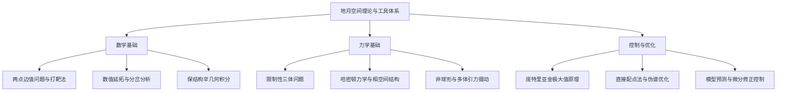

# 背景知识

地月空间轨道动力学与控制是一门深度交叉的学科。与近地开普勒二体轨道分析不同，地月空间任务设计面临强非线性引力场、混沌边缘的高灵敏度以及复杂的多体摄动环境。深入开展地月空间轨道设计、星座组网、低能转移与高精度轨道维持，必须建立在坚实的数学工具、天体力学与最优控制理论基础之上。

本栏目系统梳理支撑地月空间轨道力学的三大核心理论支柱，为各专题研究与工程实践提供严谨的推导与算法参考。

## 理论支柱与知识体系

### 1. 数学工具（Mathematical Methods）

非线性动力系统数值分析与求解的核心手段。三体问题中不存在闭合解析解，周期轨道的搜索、轨道族的生成以及不变流形的追踪，依赖于高精度的数值微分修正、连续延拓算法以及长时间积分下保能量特性的保结构算法。

- 核心内容：[打靶法与两点边值求解](/background/math/shooting-method/)、[弧长数值延拓](/background/math/continuation/)、[辛几何积分器](/background/math/symplectic-integrator/)。

### 2. 天体力学（Celestial Mechanics）

从牛顿万有引力定律与哈密顿动力学出发，刻画多体系统中的运动规律。重点剖析地球与月球双主天体引力竞争区内的相空间几何、平动点稳定性及各种环境摄动力的量级分布。

- 核心内容：[天体力学与摄动理论](/background/mechanics/perturbation/)、限制性三体动力学方程推导、共振与潮汐摄动。

### 3. 控制与优化（Control & Optimization）

为地月转移轨道设计、入轨机动、编队飞行与长期轨道维持提供最优解法。涵盖连续微推力最优轨迹生成（间接法与直接法）、脉冲推力序列全局优化以及高精度闭环轨迹追踪控制。

- 核心内容：[最优控制理论与变分法](/background/control/optimal-control/)、直接配点与伪谱法、鲁棒轨迹跟踪。

## 理论到工程的映射

| 基础理论/算法 | 地月空间工程问题 | 典型应用场景 |
| :--- | :--- | :--- |
| **单/多重打靶法** | 周期轨道搜索与连续脉冲转移拼接 | 生成 Halo/NRHO/DRO 标称轨道、TLI 轨道入轨点优化 |
| **伪弧长延续法** | 沿能量或周期参数追踪连续轨道族 | 构造完整 NRHO 轨道族、寻找轨道稳定性分岔点 |
| **辛几何积分** | 极长周期（数年/数十年）动力学演化仿真 | DRO 长期动力学寿命验证、深空编队相对构型演化 |
| **摄动动力学** | 真实星历高保真建模 | 太阳光压、月球引力不均匀性（Mascon）摄动补偿 |
| **最优控制理论** | 燃料最省或时间最短的转移轨迹合成 | 电推进低推力地月螺旋转移、月面上升着陆弹道制导 |
