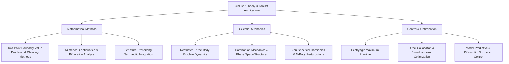

# Background Knowledge

Cislunar astrodynamics and trajectory control represent a deeply multidisciplinary domain. Unlike near-Earth Keplerian two-body orbital mechanics, mission design in cislunar space contends with strongly non-linear gravitational fields, high sensitivity near chaotic boundaries, and complex multi-body perturbation environments. Rigorous research in orbit design, constellation geometry, low-energy transfers, and high-precision station-keeping requires solid foundations in applied mathematics, celestial mechanics, and optimal control theory.

This section systematically reviews the three theoretical pillars supporting cislunar orbital mechanics, providing rigorous mathematical derivations and numerical algorithms for researchers and engineers.

## Theoretical Pillars & Knowledge Architecture

### 1. Mathematical Methods

Numerical techniques form the backbone of nonlinear dynamical system analysis. Because the three-body problem lacks general closed-form analytical solutions, periodic orbit search, family generation, and invariant manifold tracing depend heavily on high-precision numerical differential corrections, continuation algorithms, and energy-conserving geometric integrators.

- Core Topics: [Shooting Methods & Two-Point Boundary Value Problems](/en/background/math/shooting-method/), [Pseudo-Arc-Length Continuation](/en/background/math/continuation/), [Symplectic Geometric Integrators](/en/background/math/symplectic-integrator/).

### 2. Celestial Mechanics

Originating from Newtonian gravitation and Hamiltonian dynamics, celestial mechanics characterizes the equations of motion in multi-body regimes. Key focus areas include phase-space geometry in the Earth–Moon gravitational competition zone, libration point linear and non-linear stability, and environmental perturbation hierarchies.

- Core Topics: [Celestial Mechanics & Perturbation Theory](/en/background/mechanics/perturbation/), derivations of CR3BP equations of motion, orbital resonances, and tidal perturbations.

### 3. Control & Optimization

Provides optimization frameworks for Earth–Moon transfer trajectory synthesis, orbit insertion maneuvers, formation flying, and long-term station-keeping. Topics span continuous low-thrust trajectory optimization (direct and indirect methods), impulsive maneuver sequencing, and high-accuracy closed-loop tracking.

- Core Topics: [Optimal Control Theory & Calculus of Variations](/en/background/control/optimal-control/), direct collocation, pseudospectral methods, and robust trajectory tracking.

## Mapping Theory to Engineering Practice

| Fundamental Theory / Algorithm | Cislunar Engineering Challenge | Typical Application Scenario |
| :--- | :--- | :--- |
| **Single / Multiple Shooting Methods** | Periodic orbit generation & impulsive trajectory patching | Baseline Halo/NRHO/DRO orbit computation, TLI insertion point optimization |
| **Pseudo-Arc-Length Continuation** | Tracing continuous orbit families along energy/period parameters | Constructing complete NRHO families, detecting stability bifurcation points |
| **Symplectic Geometric Integration** | Long-duration (years/decades) dynamical evolution simulation | DRO lifetime validation, deep-space formation relative motion analysis |
| **Perturbation Mechanics** | High-fidelity ephemeris orbital modeling | Solar radiation pressure compensation, lunar mascon gravitational harmonics modeling |
| **Optimal Control Theory** | Fuel-optimal or minimum-time trajectory generation | Low-thrust electric propulsion spiral transfers, powered lunar descent guidance |
