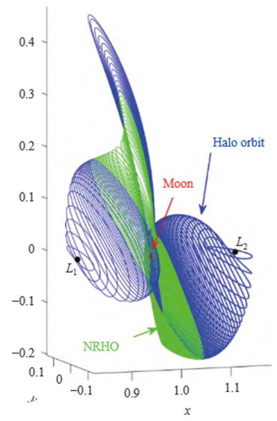

# Near-Rectilinear Halo Orbit

> Author: [Tianjiang Says](https://blog.csdn.net/qq_33254264)
>
> Website: [https://cislunarspace.cn](https://cislunarspace.cn)

## Definition

A Near-Rectilinear Halo Orbit (NRHO) is a sub-class of Halo orbits near the Earth-Moon collinear libration points $L_1$ or $L_2$. In the synodic reference frame, when the out-of-plane amplitude $A_z$ of a Halo orbit is much larger than the in-plane amplitude $A_y$, the orbit shape transitions from the classic "cashew-shaped" Halo orbit to an approximately linear reciprocating motion -- i.e., the NRHO. In other words, the NRHO corresponds to the extreme members of the Halo orbit family with large $A_z/A_y$ ratios.

*Earth-Moon L1 northern family and L2 southern family Halo orbits, with the extreme configuration being the NRHO*

## Geometric Characteristics

- **Extremely low perilune altitude**: typically below 100 km
- **Apolune**: located near the Earth-Moon $L_2$ point
- **Orbital plane symmetric about the $xOz$ plane**: with southern and northern families as two branches
- **Overall presents an approximately linear reciprocating motion**

## Resonance Relationships

Similar to DROs, NRHOs also exhibit resonance relationships with the Moon's orbital period. When the orbital period $T$ and the Moon's orbital period $T_M$ satisfy $T/T_M \approx n/m$, it is referred to as an $m:n$ synodic resonant NRHO.

| Resonance Ratio | Characteristics and Applications |
|:---|:---|
| 3:1, 4:1 (low-order) | Low perilune altitude, advantageous for lunar surface exploration and communications relay |
| **9:2** | **NASA Gateway space station selected orbit -- good stability, suitable for long-term station-keeping** |
| 11:2 (high-order) | Better orbital stability, suitable for long-duration mission |

## Dynamic Symmetry

Unlike DROs which exhibit symmetry about the $x$-axis, NRHOs display **mirror symmetry about the $xOz$ plane**. When an NRHO crosses the $xOz$ plane, the velocity components satisfy the conditions: $\dot{x}$ and $\dot{z}$ change sign while $\dot{y}$ remains unchanged. This symmetry provides natural shooting conditions for differential correction: select an initial point on the $xOz$ plane, retaining only $z_0$ and $\dot{y}_0$ as free variables, integrate for half a period, and verify the $xOz$ plane crossing conditions -- enabling iterative convergence to a periodic orbit.

## Stability Characteristics

NRHO stability analysis requires attention to:

- **Floquet multipliers**: eigenvalues of the monodromy matrix characterizing the amplification/attenuation characteristics of orbital perturbations in each direction
- **Perilune distance $r_p$**: excessively small $r_p$ may risk lunar surface impact, while excessively large $r_p$ weakens communications and exploration advantages
- **Coupling with invariant manifolds in the libration point region**: a unique dynamic characteristic distinguishing NRHOs from DROs

## Engineering Applications

NRHOs have become a popular candidate orbit for current cislunar space missions:

- **China's Chang'e-4 relay satellite "Queqiao"**: successfully operating in an Earth-Moon $L_2$ point Halo orbit, providing communications relay services for lunar far-side exploration
- **NASA "Gateway" space station**: planned deployment in the $L_2$ southern family 9:2 resonant NRHO
- **Cislunar space situation awareness**: NRHOs, with their unique orbital position, are well-suited for deploying relay communications and observation platforms

## Application in A2PPO Low-Thrust Transfer Research

Ul Haq et al. (2026) used the A2PPO (Attention-Augmented Proximal Policy Optimization) algorithm to investigate autonomous low-thrust transfers from L₂ Halo orbit to NRHO (Scenario S2):

- **Departure orbit**: L₂ southern Halo orbit ($C_J \approx 3.1211$, period 14.55 days)
- **Target orbit**: L₂ southern NRHO ($C_J \approx 3.0395$, period 6.99 days)
- **Transfer result**: 8.38 days, consuming 5.00 kg of propellant
- **Transfer characteristics**: Forms a lunar flyby geometry

Transfers between NRHO and Halo orbits require significant energy change ($C_J$ change of ~0.08) and represent a high-difficulty scenario in low-thrust trajectory optimization. A2PPO is capable of autonomously learning efficient transfer strategies without requiring an initial guess.

## Related Concepts
- [Distant Retrograde Orbit (DRO)](/en/glossary/orbits/dro/)
- [Earth-Moon L1/L2 Halo Orbits (EML1/EML2 Halo)](/en/glossary/orbits/eml-halo/)
- [A2PPO (Attention-Augmented Proximal Policy Optimization)](/en/glossary/dynamics/a2ppo/)
- [Starshade](/en/glossary/other/starshade/)
- [Birkhoff-Gustavson Normal Form](/en/glossary/dynamics/birkhoff-gustavson/)
- [Central Manifold](/en/glossary/dynamics/central-manifold/)
- [Action-Angle Variables](/en/glossary/dynamics/action-angle/)
- [Orbit Identification](/en/glossary/orbits/orbit-identification/)
- [Halo Orbit](/en/glossary/orbits/halo-orbit/)
- [Circular Restricted Three-Body Problem (CR3BP)](/en/glossary/dynamics/cr3bp/)
- [Libration Point (Lagrangian Point)](/en/glossary/dynamics/libration-point/)
- [Ephemeris Model](/en/glossary/dynamics/ephemeris-model/)
- [Invariant Manifold](/en/glossary/dynamics/invariant-manifold/)

## Core Elements

### Orbit Definition

Near-Rectilinear Halo Orbit (NRHO) is an extreme sub-class of the Halo orbit family with large $A_z/A_y$ ratio. The orbit shape transitions from the classic "cashew" form to an approximately linear reciprocating motion. The perilune altitude is extremely low (typically < 100 km), and the apolune is located near the L₂ point.

### Dynamic Characteristics

- **Resonance relationships**: NASA Gateway selected the 9:2 resonant NRHO, offering good stability for long-term station-keeping
- **Symmetry**: Mirror symmetry about the $xOz$ plane
- **Stability**: Characterized through Floquet multipliers analyzing perturbation amplification/attenuation in each direction
- **Maintenance cost**: Low (perilune distance requires precise control to balance exploration advantages against impact risk)

### Design Methods

- **Exploiting symmetry**: Select initial points on the $xOz$ plane, retaining $z_0$ and $\dot{y}_0$ as free variables
- **Half-period integration**: Verify $xOz$ plane crossing conditions, iterating to convergence on a periodic orbit
- **Resonance ratio selection**: Choose the appropriate resonance ratio based on mission requirements (e.g., 9:2, 11:2)
- **Invariant manifold analysis**: Design transfer orbits using invariant manifolds in the libration point region

## Application Value

NRHO has become a popular candidate orbit for current cislunar space missions. NASA's Gateway space station is planned for deployment in the L₂ southern family 9:2 resonant NRHO. China's Chang'e-4 relay satellite "Queqiao" has successfully operated in an L₂ point Halo orbit, validating the application value of this orbit family for lunar far-side communications relay.

## References

- Zimovan E M. Rectilinear halo orbits and their applications in cislunar space[D]. Purdue University, 2017.
- Williams J, Whitley R. Targeting cislunar rectilinear halo orbits for spacecraft missions[C]. 2017.
- Wu Weiren. Chang'e-4 Lunar Far-Side Soft Landing Mission Design[J]. 2017.
- Qiao C, Long X, Yang L, et al. Orbital parameter characterization and objects cataloging for Earth-Moon collinear libration points[J]. Chinese Journal of Aeronautics, 2025. doi: 10.1016/j.cja.2025.103869.
