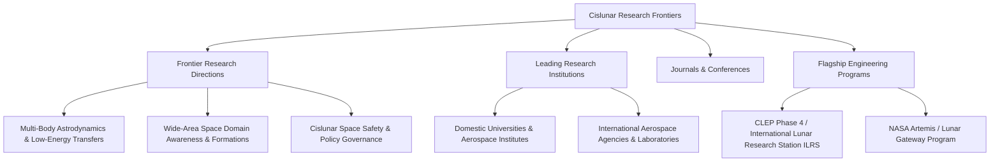

# Cislunar Space Research Frontiers

As global lunar exploration transitions from isolated flybys and robotic sample returns to permanent sustained presence, cislunar infrastructure construction, and in-situ resource utilization (ISRU), cislunar space has emerged as the foremost frontier of international deep-space science, technological innovation, and strategic collaboration.

This section systematically reviews core academic frontiers, leading research institutions, academic exchange venues, and strategic spaceflight missions, offering a holistic landscape and navigation guide for researchers, aerospace engineers, and students.

## Knowledge Architecture

## Section Guide

| Topic Section | Core Scope | Deep-Dive Link |
| :--- | :--- | :--- |
| **Frontier Research Directions** | Encompasses modern multi-body orbital dynamics, wide-area space domain awareness (SDA), autonomous navigation, constellation/formation architectures, and space governance | [Explore Research Directions](/en/research-frontiers/directions/) |
| **Leading Research Institutions** | Compiles key Chinese universities (Beihang, Tsinghua, HIT, NJU, etc.), CAST/CASIC research academies, NASA centers, ESA, and top international astrodynamics labs | [View Research Institutions](/en/research-frontiers/institutions/) |
| **Journals & Conferences** | Curates top publication and presentation venues, including Acta Astronautica, AIAA/AAS conferences, Advances in Space Research, and Chinese Journal of Aeronautics | [Browse Journals & Conferences](/en/research-frontiers/journals-conferences) |
| **Flagship Engineering Programs** | Tracks strategic exploration initiatives including Chang'e series, Queqiao relays, ILRS, and the Artemis architecture | [Track Flagship Programs](/en/research-frontiers/major-projects) |

## Cross-Reference Recommendations

- **Theoretical Rigor**: For underlying numerical algorithms and optimal control techniques powering frontier research, consult [Background Knowledge](/en/background/).
- **Terminology & Definitions**: To clarify specialized acronyms and formal mathematical definitions found in recent literature, search the [Glossary](/en/glossary/).
- **Algorithms & Code**: Access open-source astrodynamics toolkits, ephemeris datasets, and computational scripts under [Data & Code](/en/resources-tools/).
