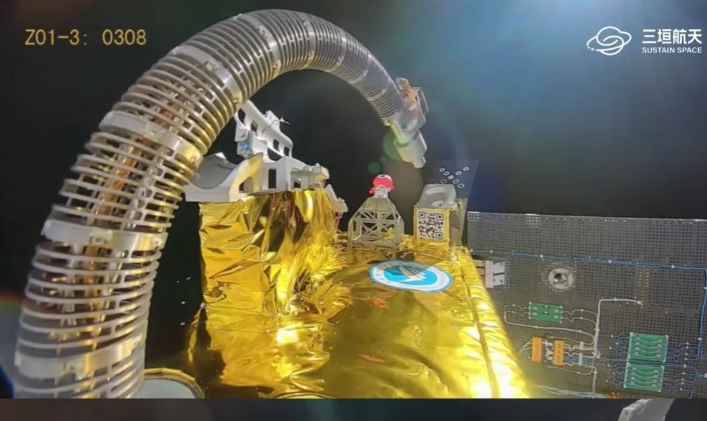

# Chinese Startup Sustain Space Validates Flexible Robotic Arm On-Orbit, Advancing Servicing Capabilities

**Summary:** Chinese commercial space company Sustain Space (Sanyuan Aerospace) successfully completed on-orbit demonstrations of a flexible robotic arm aboard its Xiyuan-0 satellite. Launched March 16 on a Kuaizhou-11 rocket, the satellite tested simulated refueling operations, force-compliant manipulation, and precision control. On March 25, the company announced all on-orbit operations were successfully completed, with all four operation modes verified.

*Credit: Sustain Space*

## Mission Overview

Sustain Space's Xiyuan-0 satellite (also known as Yuxing-3 (06)) was launched aboard a Kuaizhou-11 rocket on March 16 (UTC). The satellite features a flexible robotic arm designed to test simulated refueling operations, force-compliant manipulation, and precision control.

According to a March 25 statement from Sustain Space, all on-orbit operations of the flexible robotic arm have been successfully completed, marking what the company describes as a step forward for China's commercial space industry in on-orbit space services.

## Four Operation Modes Verified

Sustain Space successfully verified four operation modes:

1. **Pre-programmed autonomous refueling simulation**: The robotic arm autonomously executed simulated satellite refueling operations
2. **Human teleoperation**: Ground operators remotely controlled the arm's movements in real time
3. **Vision-based servo operations**: Precision positioning and manipulation based on optical feedback
4. **Force-controlled drawing tests**: Verifying the arm's force-sensing and force-control capabilities

## Industry-Academic Partners

Development of the satellite involved multiple partners demonstrating industrial-academic cooperation:

- **Shenzhen Mofang Satellite Technology Co., Ltd.**: Satellite platform provider
- **Tsinghua University Shenzhen International Graduate School**: Co-developer of the robotic arm
- **Hunan University of Science and Technology**: Optical payload for vision-based control and teleoperation feedback
- **Emposat**: Communications and operations support

## On-Orbit Servicing Prospects

The tests mark progress toward on-orbit servicing capabilities including satellite life extension, in-space assembly, and debris mitigation. The reported refueling activities were simulations, with no actual propellant transfer confirmed.

In addition to the robotic arm tests, the Xiyuan-0 satellite will conduct an accelerated deorbit experiment using a deployable drag-augmentation sphere, demonstrating a potential method for reducing orbital lifetime and mitigating space debris.

## Global Context

On-orbit servicing is a hot area in the global space industry:

- China's Shijian-21 and Shijian-25 spacecraft appear to have completed pioneering on-orbit refueling tests in GEO in 2025
- U.S. companies like Astroscale and Northrop Grumman are pursuing similar capabilities using different technical approaches
- NASA cancelled its OSAM-1 project in 2024 due to delays and cost overruns, though the agency continues to support in-space servicing technology development

## Sources

- [Chinese startup tests flexible robotic arm in space for on-orbit servicing — SpaceNews](https://spacenews.com/chinese-startup-tests-flexible-robotic-arm-in-space-for-on-orbit-servicing/)
