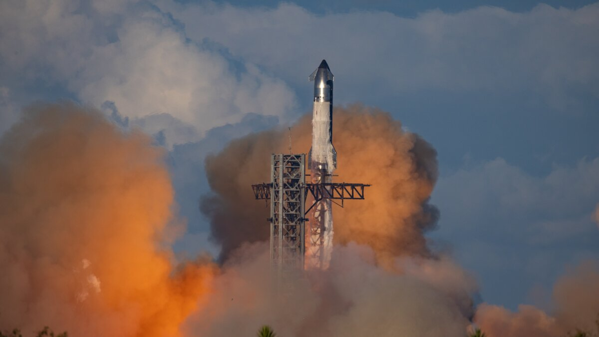

# SpaceX Files Confidential IPO Registration with SEC, Targeting Record-Breaking Public Offering

**Summary:** SpaceX has confidentially submitted a draft IPO registration to the U.S. Securities and Exchange Commission (SEC) on April 2, Bloomberg reported. The company is targeting a valuation exceeding $1.75 trillion and could raise up to $50 billion, which would easily surpass Saudi Aramco's 2019 record of $29 billion. Morgan Stanley, Goldman Sachs, JPMorgan Chase, Bank of America, and Citigroup are serving as lead underwriters among 21 participating banks.

*Credit: CGTN*

## Key Details

- **Confidential Filing**: SpaceX submitted its draft S-1 registration to the SEC on April 2, allowing the company to receive feedback before public disclosure.
- **Target Valuation**: Over $1.75 trillion, which would make SpaceX larger than Meta Platforms and rank it among the top six companies in the S&P 500.
- **Fundraising**: Up to approximately $50 billion, potentially the largest IPO in history.
- **Underwriting Syndicate**: 21 banks participating, led by Morgan Stanley, Goldman Sachs, JPMorgan Chase, Bank of America, and Citigroup.
- **Saudi PIF**: Saudi Arabia's Public Investment Fund is reportedly considering an anchor investment.
- **Use of Proceeds**: According to a memo obtained by Bloomberg, SpaceX plans to fund an "insane flight rate" for its Starship rocket, space-based AI data centers, and a lunar base.
- **Valuation Driver**: Analysts identify Starlink satellite internet as the primary revenue source backing the $1.75 trillion valuation.

## Context

Founded in 2002 by Elon Musk, SpaceX began as a launch services provider and has expanded into satellite communications (Starlink) and artificial intelligence after acquiring xAI (valued at approximately $230 billion) in February 2026. The company's current private market valuation stands at around $800 billion.

SpaceX's IPO is one of three mega-IPOs expected in 2026, alongside OpenAI and Anthropic.

## Sources (original pages)

- [SpaceX files for potentially record-breaking IPO - CGTN](https://news.cgtn.com/news/2026-04-02/SpaceX-files-for-potentially-record-breaking-IPO-media-1M0MfLwVmmY/p.html)
- [史上最大IPO要来了！马斯克旗下SpaceX递交上市申请 - 扬子晚报](https://www.yangtse.com/news/ch/202604/t20260403_338439.html)
- [SpaceX IPO 2026: $1.75 Trillion Valuation - US Reporter](https://usreporter.com/)

> Note: The confidential SEC filing has not been made public. Final fundraising amounts and valuation may change.
