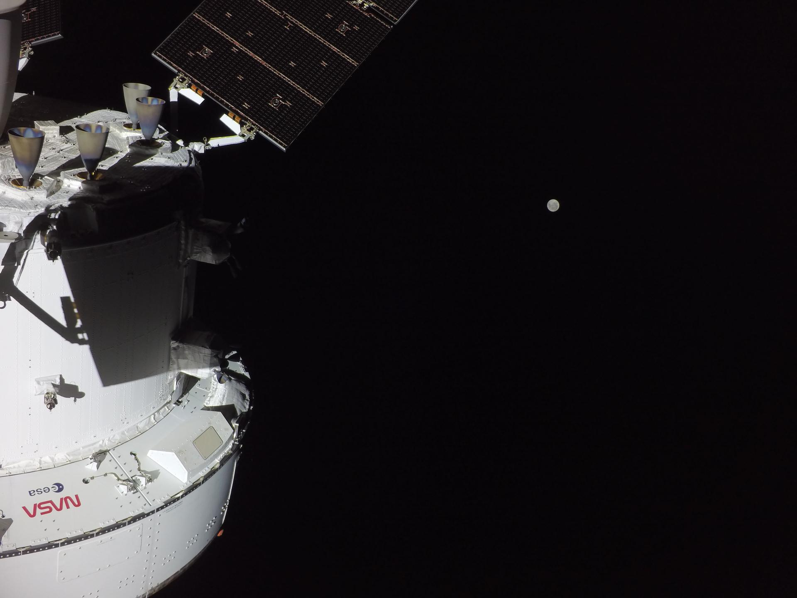

# Artemis II Orion Spacecraft Toilet Malfunction: Frozen Waste Line and Burning Smell En Route to Moon

**Summary:** On April 3 (Flight Day 3), as Artemis II reached the midpoint of its trans-lunar coast, the four-person crew reported a burning odor from the Orion spacecraft's toilet area, while the main waste water vent appeared to be freezing up. Ground control assessed no major safety risk, advised the crew to temporarily use emergency urine collection bags, and is working on a solar-heating de-icing plan. This marks the second challenge for Orion's life support systems after a Day 1 toilet issue.

*Credit: NASA*

## Burning Odor in the Hygiene Compartment

On Flight Day 3, CSA astronaut Jeremy Hansen first reported a burning smell emanating from the hygiene compartment. He told Mission Control: "It was a burnt smell to me, and it was definitely coming from the hygiene compartment. When I opened the door, the rest of the crew could smell it almost immediately."

NASA astronaut Christina Koch described the odor as similar to what the crew noticed on Day 1 — "a heater burning kind of smell." Mission Control initially suspected the orange insulation material around the compartment door might be the source, but confirmed the crew could continue using the facility normally: "Overall, we have no major concerns."

During pre-flight training, ground teams had warned the crew that a similar odor might appear when the toilet's heater was first activated, comparing it to "a heater that's been sitting idle for a long time being turned on for the first time."

## Frozen Waste Water Vent

A more significant concern is the apparent freezing of Orion's main waste water vent. This issue first appeared on Day 1, when Koch worked with Mission Control to temporarily restore toilet operations. The freezing persisted, and ground teams advised the crew to use emergency urine collection bags for the time being.

Mission Control is studying ways to use sunlight exposure and onboard heaters to warm up the waste nozzle and clear the ice blockage. Given the spacecraft's increasing distance from Earth and extremely cold deep-space environment, a full resolution may take time.

## A Recurring Challenge in Human Spaceflight

Toilet malfunctions have a long history in human spaceflight. The ISS and Space Shuttle programs experienced multiple toilet-related incidents, including a 2020 leak in the Russian Zvezda service module's toilet and a 2008 liquid waste separator failure on the ISS. Liquid-gas separation and waste disposal remain persistent design challenges in crewed spacecraft life support systems.

Orion's toilet system is an all-new design making its first crewed flight validation on Artemis II. Post-mission assessments will provide critical data for improving the system ahead of Artemis III's planned lunar landing mission.

## Sources (original pages)

- [IT Home (via QQ): NASA Astronauts Encounter Frozen Toilet Waste Pipe En Route to Moon](https://new.qq.com/rain/a/20260405Q03YOL00)
- [Sina Tech: NASA Artemis 2 Orion Toilet Emits Burning Smell](https://k.sina.com.cn/article_5953190046_162d6789e06702wz92.html)
- [NASA Artemis II Mission Page](https://www.nasa.gov/mission/artemis-ii/)
