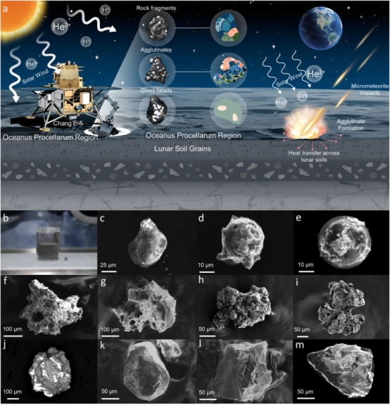

# China Achieves First Precise Thermal Conductivity Measurement of Single Lunar Soil Particles

**Summary:** A joint research team from the Technology and Engineering Center for Space Utilization (CAS), Tsinghua University, and the Institute of Geochemistry (CAS) has achieved the first precise measurement of single-particle thermal conductivity in Chang'e-5 lunar soil. The study reveals that agglutinate particles exhibit thermal conductivity as low as ~8 mW·m⁻¹·K⁻¹ under vacuum conditions — rivaling high-performance synthetic aerogels and representing the lowest thermal conductivity ever reported for a natural material.

*Credit: CNSA*

## Background and Particle Classification

Lunar soil particles fall into three categories based on morphology: **agglutinates**, **rock fragments**, and **glass beads**. Agglutinates are products of lunar space weathering — their glassy matrix forms from impact melting and encapsulates mineral fragments (plagioclase, pyroxene, olivine). Rapid cooling traps gases, creating a hierarchical pore structure spanning nano- to micrometer scales.

Porosity varies dramatically: agglutinates ~17.78%, rock fragments ~4.02%, glass beads ~1.38%.

## Key Results

The team used a custom-designed cantilever H-type micro/nano thermal bridge device in high vacuum to measure intrinsic thermal conductivity:

| Particle Type | Thermal Conductivity (253 K) | Comparison |
|--------------|------------------------------|------------|
| Agglutinate | ~8 mW·m⁻¹·K⁻¹ | Baseline |
| Rock fragment | ~27–79 mW·m⁻¹·K⁻¹ | 3–5× agglutinate |
| Glass bead | ~120–490 mW·m⁻¹·K⁻¹ | 1–2 orders higher |

Agglutinates are the most thermally insulating component in lunar soil, with conductivity reduced to ~12% of ideal dense crystalline minerals.

## Physical Mechanism

The ultra-low thermal conductivity of agglutinates stems from their multi-scale structure:
- **Amorphous molten glass** binding diverse mineral fragments limits phonon mean free path
- **Nano-to-micrometer hierarchical pore networks** enhance phonon scattering and interfacial thermal resistance
- **Multi-phase interfaces** (plagioclase, olivine, etc. with glass phase) exhibit significant vibrational mismatch, with interfacial thermal resistance up to 1000× that of ideal crystal-crystal interfaces

## Applications

- **Lunar surface thermal modeling:** Reliable material properties for lander and in-situ equipment thermal design
- **In-situ resource utilization:** Thermal behavior prediction for lunar soil manufacturing and volatile extraction
- **Novel materials:** The multi-scale structure of lunar agglutinates provides a natural template for developing new extreme-environment insulation materials

## Sources

- [CNSA: First precise measurement of single-particle thermal conductivity in lunar soil (Chinese)](https://www.cnsa.gov.cn/n6758823/n6758838/c10737620/content.html)
