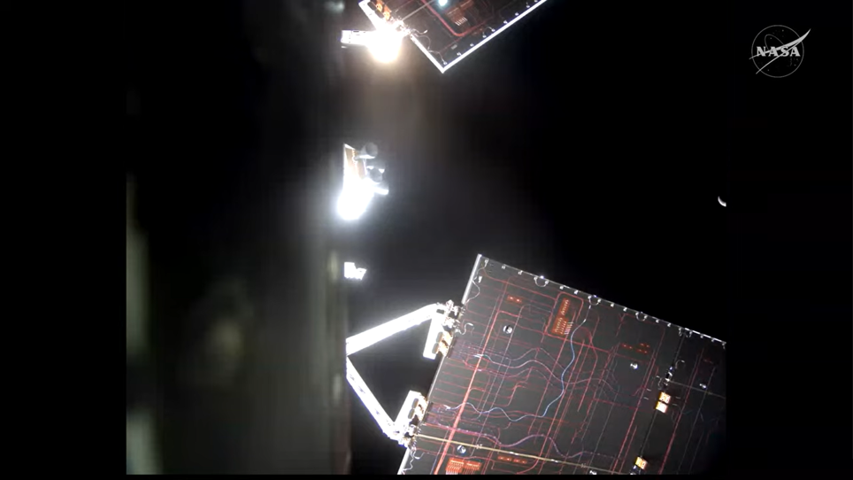

# NASA Completes First Return Correction Burn for Artemis II Mission, Progressing Smoothly

**Summary:** NASA announced the successful completion of the first return correction burn on Artemis II mission day 7, with Orion spacecraft 'Integrity' igniting thrusters for 15 seconds to adjust the return trajectory. Astronauts are currently testing anti-gravity equipment and conducting manual control demonstrations.

## Sources (original pages)

- [Artemis II Flight Day 7: First Return Correction Burn Complete - NASA](https://www.nasa.gov/blogs/missions/2026/04/07/artemis-ii-flight-day-7-first-return-correction-burn-complete/)

> Republication note: This article is republished from the official NASA website, with information from the National Aeronautics and Space Administration. Image source is official NASA imagery, which is in the public domain.

---

### First Return Correction Burn Successfully Completed

At 8:03 p.m. EDT on April 7, the Orion spacecraft 'Integrity' successfully ignited its thrusters for 15 seconds, producing a velocity change of 1.6 feet-per-second and guiding the Artemis II crew toward Earth. This burn marks the successful completion of a critical step in the post-lunar flyby return phase.

### Astronaut Activities Progress

NASA astronaut Christina Koch and Canadian Space Agency (CSA) astronaut Jeremy Hansen reviewed procedures and monitored the spacecraft's configuration and navigation data. During today's mission status briefing, NASA officials shared the first images received from the crew during the lunar flyby.

### Recovery Operations Ready

The USS John P. Murtha has left port and is headed to the midway point toward the recovery site in the Pacific Ocean. NASA will provide updates on recovery operations and weather during the daily Mission Status briefings.

### Upcoming Flight Test Objectives

The crew will prepare for a full day of flight test objectives and return to Earth tasks on Wednesday, April 8. Key upcoming tests include:

#### 1. Orthostatic Intolerance Garment Test
NASA astronauts Reid Wiseman, Victor Glover, along with Koch and Hansen, will test an orthostatic intolerance garment. During the test, the crew will evaluate the garments—specialized equipment designed to help astronauts maintain blood pressure and circulation during the transition back to Earth's gravity.

#### 2. Manual Control Demonstration
Following the garment testing, the crew will take manual control of the spacecraft, using Orion's field of view to center a designated target before guiding the spacecraft to a tail-to-Sun attitude and comparing Orion's control modes. The manual piloting demonstration will begin at 9:59 p.m.

### Real-time Mission Updates

NASA provides multiple channels for real-time updates:
- Artemis II Multimedia Resource Page
- X @NASAArtemis
- Facebook @NASAArtemis
- Instagram @NASAArtemis
- NASA YouTube Channel for live mission coverage

The Artemis II mission represents a significant milestone in NASA's return to the Moon program, laying the foundation for future human deep space exploration endeavors.