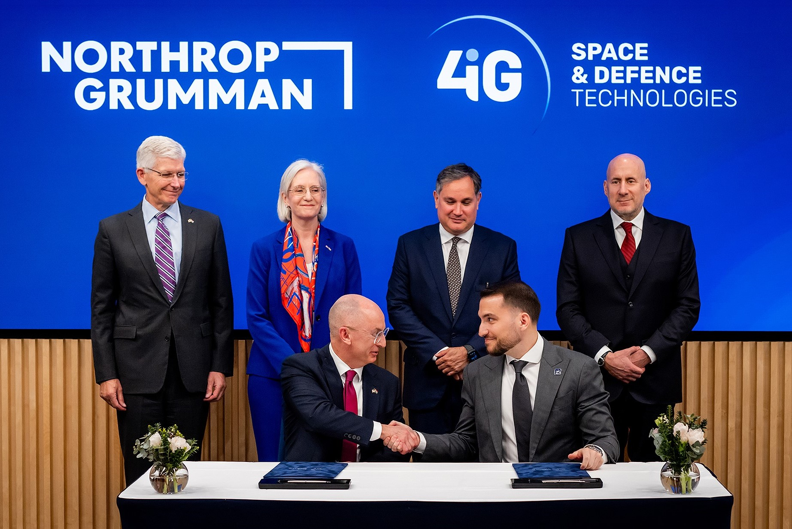

# Hungary Taps Northrop Grumman for First National GEO Communications Satellite HUSAT

**Summary:** On April 7, Hungary signed a contract with Northrop Grumman to build HUSAT, the country's first geostationary communications satellite. Developed jointly with Hungarian IT group 4iG, the satellite is expected to launch in 2028 and will provide communications and broadcasting services covering Central Europe and surrounding regions.

*Credit: Northrop Grumman*

## Project Overview

HUSAT is Hungary's first GEO communications satellite project, marking the Central European nation's formal entry into geostationary satellite operations. Key details:

- **Developer**: Northrop Grumman (prime contractor), 4iG Group (Hungarian partner)
- **Orbit**: Geostationary orbit (specific orbital slot not publicly disclosed)
- **Launch**: Expected 2028
- **Service area**: Communications and broadcasting for Central Europe and surrounding regions

## Strategic Significance

For Hungary, HUSAT carries multiple strategic benefits:

- **Digital sovereignty**: Indigenous communications satellite capability reduces dependence on foreign satellite services
- **Economic development**: Satellite communications services will advance Hungary's digital economy and telecommunications industry
- **European standing**: Hungary joins a select group of European nations operating GEO communications satellites

For Northrop Grumman, the HUSAT contract further expands its commercial satellite business footprint in the European market.

## Sources

- [Hungary Taps Northrop Grumman for First National Geostationary Communications Satellite — SpaceNews](https://spacenews.com/hungary-taps-northrop-grumman-for-first-national-geostationary-communications-satellite/)
