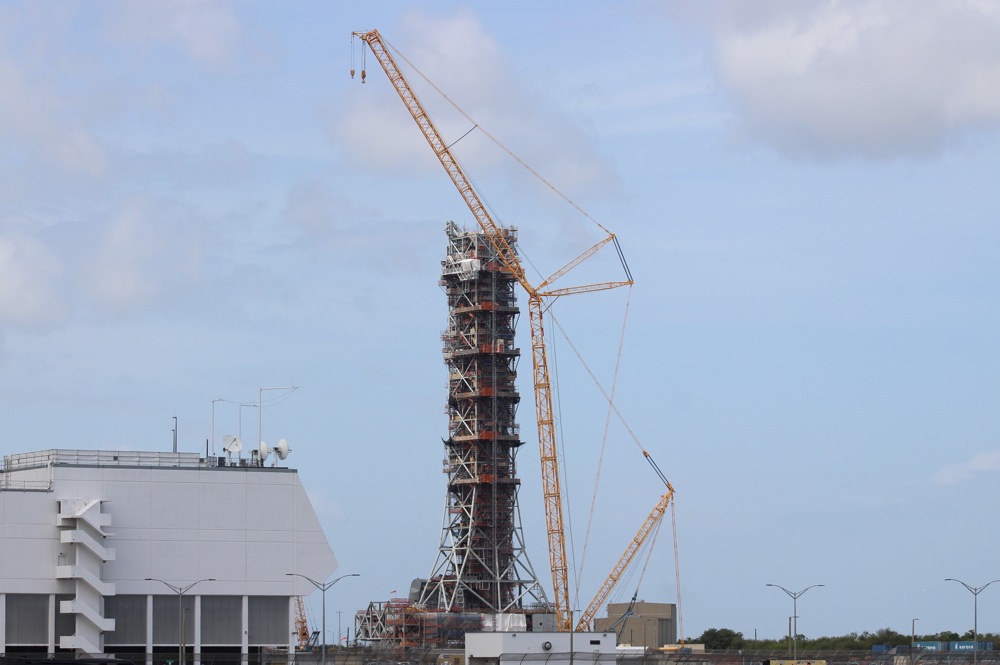

# NASA Halts Work on SLS Mobile Launcher 2, Casting Doubt on Artemis IV and Beyond

**Summary:** NASA has ordered a halt to construction of Mobile Launcher 2 (ML-2), the ground infrastructure designed for the SLS Block 1B rocket. Built by Bechtel under a contract initially valued at $383 million, the project has consumed over $1 billion with no completion in sight. The stop-work order directly threatens the Artemis IV mission timeline and beyond, as the enhanced lift capacity of SLS Block 1B requires ML-2 to launch.

*Credit: NASA/Jacob Dietrich*

## Background: The ML-2 Project

Mobile Launcher 2 (ML-2) is critical ground infrastructure designed to support the SLS Block 1B launch vehicle. Unlike ML-1, which is configured for the SLS Block 1 used in Artemis I–III, ML-2 must accommodate the taller SLS Block 1B, which features the Exploration Upper Stage (EUS) capable of delivering greater payload mass to deep space.

NASA awarded the ML-2 design and construction contract to Bechtel in 2019 with an initial value of approximately $383 million and a planned delivery date of March 2023. However, the project experienced severe cost overruns and schedule delays: by early 2026, cumulative spending exceeded $1 billion, with completion pushed back to late 2027 at the earliest.

## Reasons for the Stop-Work

NASA had repeatedly warned about ML-2's cost and schedule risks. A 2025 independent review identified fundamental design flaws and management issues with the project. The stop-work order signals that NASA is reassessing the project's overall direction and may consider alternative approaches.

## Impact on the Artemis Program

ML-2 delays directly affect the Artemis IV timeline and beyond:

- **Artemis IV** was planned to use SLS Block 1B, requiring ML-2 as its ground infrastructure
- Without ML-2, NASA would need to continue using the less capable SLS Block 1 or find alternative launch solutions
- Large components of the Lunar Gateway space station also require SLS Block 1B's enhanced lift capacity for orbital delivery

NASA has not yet announced alternative plans for ML-2 or a timeline for resuming construction.

## Sources

- [NASA Stops Work on SLS Mobile Launcher 2 — SpaceNews](https://spacenews.com/nasa-stops-work-on-sls-mobile-launcher-2/)
