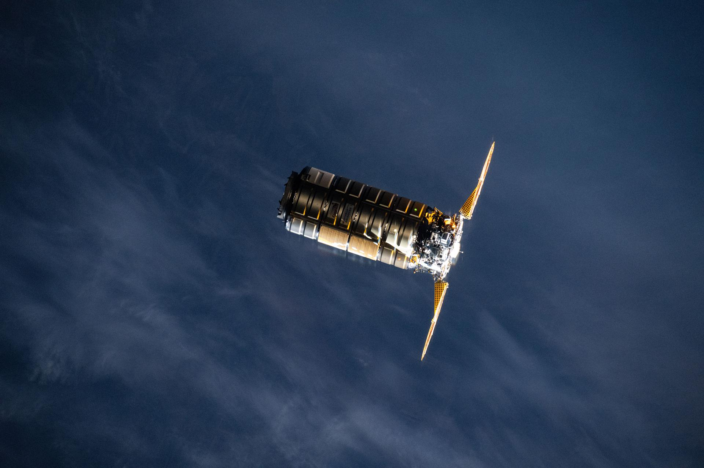

# Northrop Grumman CRS-24 ISS Resupply Mission Delayed Again to April 11

**Summary:** Northrop Grumman's 24th Commercial Resupply Services mission (NG-24) has been delayed again. Originally scheduled for April 8 from Cape Canaveral's SLC-40, the launch has now been postponed three times to no earlier than April 11 at 7:41 a.m. EDT. The Cygnus spacecraft, named S.S. Steven R. Nagel, will carry over 8,000 pounds of science investigations and cargo to the International Space Station.

*Credit: NASA*

## Delay History

NG-24 has experienced multiple launch date changes:

- **Original plan**: April 8
- **First delay**: April 9
- **Second delay**: April 10
- **Current plan**: NET April 11, 7:41 a.m. EDT (11:41 UTC)

The delays were coordinated between NASA and Northrop Grumman, citing additional time needed for final preparations of the payload and spacecraft.

## Mission Details

- **Launch vehicle**: SpaceX Falcon 9 (not Northrop Grumman's retired Antares rocket)
- **Launch site**: SLC-40, Cape Canaveral Space Force Station, Florida
- **Spacecraft**: Cygnus, named S.S. Steven R. Nagel (honoring former NASA astronaut Steven Nagel)
- **Cargo mass**: Over 8,000 lbs (~3,600 kg) of science investigations and supplies

## Impact on Station Operations

The ISS relies on multiple commercial cargo providers for resupply. The NG-24 delay does not affect daily station operations, though the start of some science experiments will be pushed back accordingly. SpaceX's Dragon and Northrop Grumman's Cygnus are the two primary commercial ISS resupply vehicles.

## Sources

- [Launch Schedule — Spaceflight Now](https://spaceflightnow.com/launch-schedule/)
