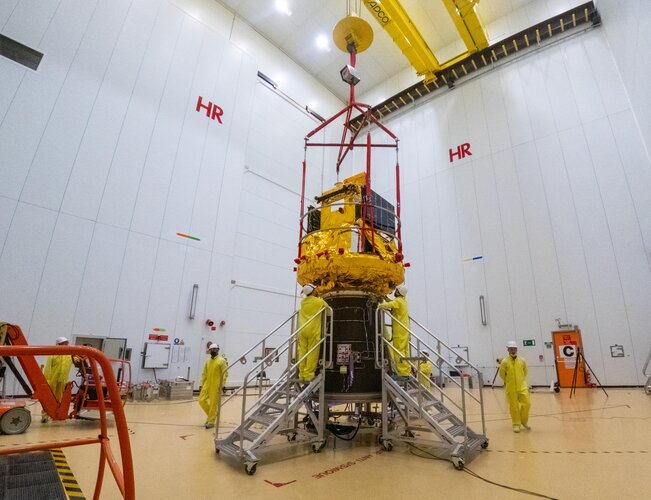

# China-ESA Joint SMILE Satellite Launch Postponed Due to Vega-C Technical Issue, New Date TBC

**Summary:** ESA announced ahead of the April 9 launch window that the joint China-ESA SMILE science satellite launch has been postponed. The cause is a technical issue discovered on a subsystem component production line after the VV29 launcher (Vega-C) had been fully integrated. A new launch date has not yet been determined.

*Credit: ESA*

## SMILE Mission Overview

SMILE (Solar wind Magnetosphere Ionosphere Link Explorer) is a major space science mission jointly implemented by ESA and the Chinese Academy of Sciences (CAS):

- **Science objectives**: Study the interaction between the solar wind and Earth's magnetosphere to improve understanding of solar storms, geomagnetic storms, and space weather science
- **Orbit**: Highly elliptical orbit with an apogee of approximately 121,000 km above the North Pole, enabling simultaneous observation of the magnetopause and polar ionosphere
- **Science payload**: Four instruments — Soft X-ray Imager (SXI), Ultraviolet Imager (UVI), Light Ion Analyzer (LIA), and Magnetometer (MAG)
- **Design life**: 3 years
- **International collaboration**: Involving over 250 scientists

## Postponement Details

ESA updated the launch status on its official mission page:

> "Launch date: 9 April 2026 (postponed due to a technical issue occurred on a subsystem component production line after VV29 launcher integration, new launch date TBC)"

The postponement is unrelated to the satellite itself but concerns the launch vehicle. The Vega-C rocket (flight designation VV29) had completed integration, but subsequent inspections revealed a technical issue with a subsystem component. ESA and Arianespace are evaluating remediation options and will announce a new launch date once confirmed.

## Launch Preparation Timeline

SMILE had completed all pre-launch preparations:

- February 2026: Departed Saint-Nazaire, France, shipped by sea to Europe's Spaceport in Kourou, French Guiana
- March 2026: Arrived at the spaceport, completed propellant loading
- March 30, 2026: Integrated with Vega-C rocket
- Late March: Pre-launch media briefing completed

## China's Role

The Chinese Academy of Sciences is a core partner in the SMILE mission. China is responsible for providing two key science instruments (the Light Ion Analyzer and Magnetometer) as well as satellite platform development and testing. SMILE represents another major China-Europe space science collaboration following the Double Star mission.

## Sources

- [ESA SMILE Mission Page](https://www.esa.int/Science_Exploration/Space_Science/SMILE)
- [Smile Prepares for Launch on Vega-C – Follow Along — ESA](https://www.esa.int/Science_Exploration/Space_Science/Smile_prepares_for_launch_on_Vega-C_follow_along)
