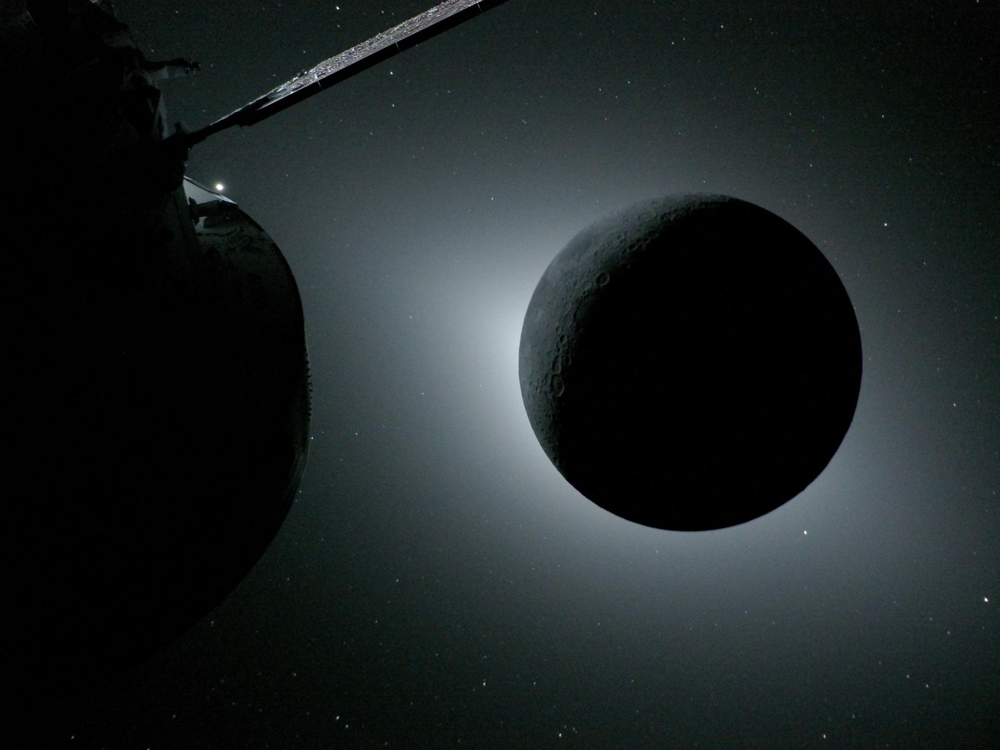

# Artemis II Science Underway as Orion Begins Return Trip to Earth

**Summary:** The Artemis II Orion spacecraft "Integrity" has entered its return leg after completing a historic lunar flyby. The four crew members captured more than 175 GB of images during the April 6 flyby, with about 50 GB already returned via an experimental laser communications payload — including 20 GB transmitted in just over 45 minutes. NASA says all lunar science data will be publicly released within six months of splashdown. Splashdown is scheduled for 8:07 PM EDT on April 10, off the coast of San Diego, California.

*Credit: NASA*

## Return Journey and Science Data

On April 6, Reid Wiseman, Victor Glover, Christina Koch, and Jeremy Hansen became the first people in more than half a century to fly around the Moon. After the flyby, the spacecraft executed a 15-second reaction control system thruster burn, adjusting velocity by about 0.5 meters per second to begin the return trajectory.

Science team lead Kelsey Young said at a press briefing that among the thousands of images already returned, "every single image has something that surprises me." In addition to high-resolution photographs, the crew recorded hours of voice narration documenting their real-time observations of the lunar surface.

## Laser Communications Breakthrough

The experimental laser communications payload aboard Orion demonstrated remarkable potential: it successfully returned 20 GB of data in just over 45 minutes — orders of magnitude faster than the traditional S-band telemetry system. About 50 GB of data had been returned to the ground as of the briefing.

## Toilet Issue Update

The previously reported Orion spacecraft toilet malfunction — a partially blocked wastewater vent line — remains ongoing. Engineers have ruled out ice buildup and now suspect chemistry or biofilm debris clogging a filter. The issue does not affect mission safety.

## Splashdown and Data Release Timeline

- **Splashdown time:** April 10, 8:07 PM EDT
- **Splashdown location:** Off the coast of San Diego, California
- **Science reports:** Two reports to be released within six months of splashdown — one on the science team's structure and operations, and a preliminary lunar science report addressing 10 pre-mission science objectives

*Solar eclipse as seen from the Orion spacecraft during the lunar flyby. Credit: NASA*

## Sources (original pages)

- [Artemis 2 science gets underway as Orion begins its return trip — SpaceNews](https://spacenews.com/artemis-2-science-gets-underway-as-orion-begins-its-return-trip/)
- [NASA's Artemis II Crew Beams Official Moon Flyby Photos to Earth — NASA](https://www.nasa.gov/news/)
- [Twin NASA Control Rooms Support Artemis Safety, Success — NASA](https://www.nasa.gov/news/)
