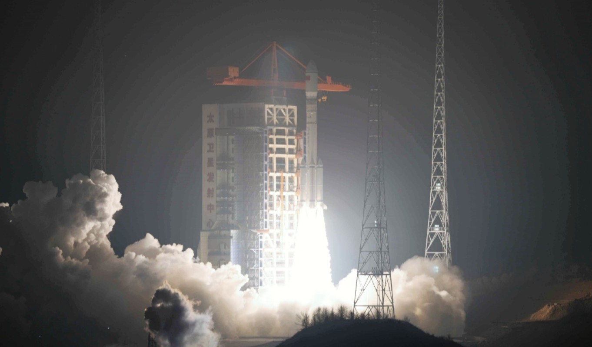

# China Launches Long March Rockets for Thousand Sails and Guowang Megaconstellations

**Summary:** China conducted two separate Long March launches this week, adding new batches of satellites to its two Starlink-rival megaconstellation programs. On April 7, a Long March 8 lifted off from the Hainan Commercial Space Launch Site, deploying 18 satellites for the Thousand Sails constellation, bringing its total to 126 spacecraft. On April 8, a Long March 6A launched from Taiyuan carrying the 21st group of Guowang satellites (approximately 5), raising Guowang's operational constellation to 168 satellites. These were China's 20th and 21st orbital launch attempts of 2026.

*Credit: CASC*

## Thousand Sails (Qianfan) — Long March 8

- **Launch time:** April 7, 9:32 AM Eastern (13:32 UTC)
- **Launch site:** Hainan Commercial Space Launch Site
- **Rocket:** Long March 8
- **Payload:** 18 Thousand Sails satellites (manufactured by IAMCAS)
- **Total in orbit:** 126 satellites (7th launch)
- **Project lead:** Shanghai Spacecom Satellite Technology (SSST/Spacesail)

This was the first Thousand Sails launch since October 2025. Some earlier satellites had previously failed to raise their orbits as expected.

## Guowang — Long March 6A

- **Launch time:** April 8, 3:38 PM Eastern (19:38 UTC)
- **Launch site:** Taiyuan Satellite Launch Center
- **Rocket:** Long March 6A
- **Payload:** 21st group of approximately 5 Guowang satellites
- **Total in orbit:** 168 operational phase satellites (excluding test satellites)
- **Manufacturers:** Innovation Academy for Microsatellites of CAS (IAMCAS), China Academy of Space Technology (CAST)

According to ITU filings, the Guowang constellation is planned for 13,000 satellites, with a near-term target of approximately 400 satellites by 2027.

## Context

These launches followed the April 3 maiden flight failure of Space Pioneer's Tianlong-3 commercial rocket. China is targeting approximately 140 orbital launches in 2026 — a 52% increase over the record 92 launches in 2025. The new Five-Year Plan (2026–2030) has elevated satellite internet and reusable launch vehicles as priority industries.

## Sources (original pages)

- [China conducts pair of Long March launches for Thousand Sails and Guowang megaconstellations — SpaceNews](https://spacenews.com/china-conducts-pair-of-long-march-launches-for-thousand-sails-and-guowang-megaconstellations/)
- [China targets 140 launches in 2026 amid commercial space surge — SpaceNews](https://spacenews.com/china-targets-140-launches-in-2026-amid-commercial-space-surge/)
