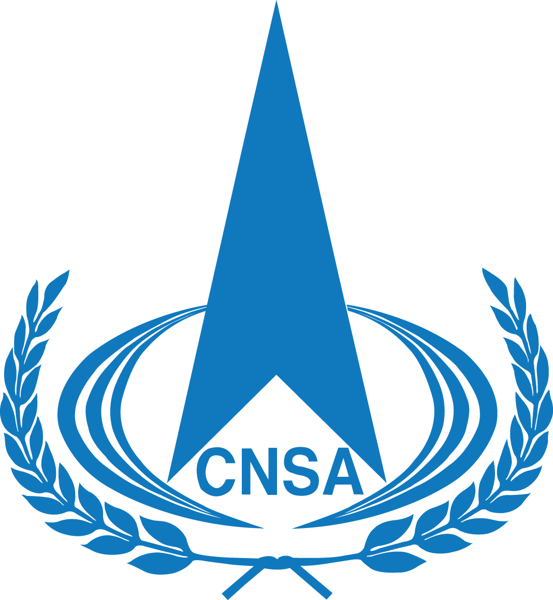

# CNSA Holds Enterprise Roundtable on High-Quality Commercial Space Development

**Summary:** On April 21, 2026, Shan Zhongde, member of the Party Leadership Group and Vice Minister of the Ministry of Industry and Information Technology (MIIT) and Administrator of the China National Space Administration (CNSA), chaired a roundtable on high-quality commercial space development. The meeting focused on forming integrated development momentum across the "rocket-satellite-launch-site-spectrum-network" chain and heard reports and suggestions from 14 commercial space enterprises.

*Image source: CNSA*

## Meeting Background

On April 21, Shan Zhongde, member of the Party Leadership Group and Vice Minister of MIIT and CNSA Administrator, chaired the roundtable on high-quality commercial space development. The meeting thoroughly studied and implemented General Secretary Xi Jinping's important discussions and instructions on accelerating the building of a space power, deeply implemented the deployments of the Fourth Plenary Session of the 20th CPC Central Committee, and implemented the spirit of the Central Economic Work Conference and the National People's Congress and Chinese People's Political Consultative Conference sessions. The focus was on forming integrated development momentum across the "rocket-satellite-launch-site-spectrum-network" chain and accelerating commercial space industrialization.

CNSA Vice Administrator Bian Zhigang and Chief Engineer Li Guoping attended the meeting.

## Participating Enterprises and Topics

At the meeting, leaders from 14 enterprises spanning rocket development, satellite manufacturing, commercial launch services, satellite tracking and control, constellation construction, and satellite applications engaged in discussions on development approaches, challenges, and suggestions regarding R&D and production, licensing and market access, launch applications, frequency coordination, in-orbit operations, and application promotion.

Relevant departments and affiliated institutions of MIIT and CNSA responded to the enterprises' issues, demands, and suggestions on the spot.

## Meeting Highlights

The meeting noted that commercial space is an important force for developing new quality productive forces and building a space power. The CPC Central Committee attaches great importance to the high-quality development of commercial space. General Secretary Xi Jinping has clearly pointed out to "gradually release the development potential of emerging industries such as commercial space while ensuring safety," providing direction and fundamental guidance for commercial space development. The meeting emphasized the need to adhere to Xi Jinping Thought on Socialism with Chinese Characteristics for a New Era, thoroughly implement the spirit of the 20th CPC National Congress and subsequent plenary sessions, coordinate development and security, further improve top-level design for commercial space development, strengthen policy supply, continuously optimize commercial space entry-exit mechanisms and licensing approval processes, and promote high-quality commercial space development with a more open posture and more pragmatic measures.

*Image source: CNSA*

## Source (Original)

- [CNSA Holds Enterprise Roundtable on High-Quality Commercial Space Development](https://www.cnsa.gov.cn/n6758823/n6758838/c10744822/content.html)
