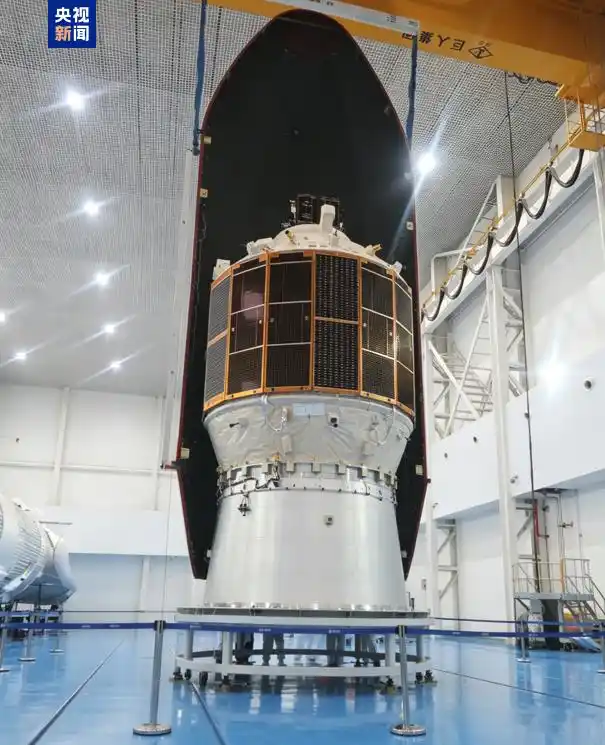

# Space Metal Additive Manufacturing Technology Demonstrated on Light Ark Test Spaceship

**Summary:** A joint research team from the Chinese Academy of Sciences (CAS) Institute of Mechanics and the CAS Innovation Academy for Microsatellites has successfully demonstrated space metal additive manufacturing (3D printing) technology aboard the Light Ark test spaceship. The space metal additive manufacturing payload, launched aboard the Light Ark test spaceship by a CAS Space Kuaizhou-2 (力箭二号) rocket, completed its planned experimental mission at a 600 km orbit, marking China's preliminary capability in space-based metal manufacturing system verification.

## Sources (original pages)

- [People's Daily: "China's Space Metal Additive Manufacturing Technology Achieves Breakthrough" (April 28, 2026)](http://finance.people.com.cn/n1/2026/0428/c1004-40709940.html)
- [CCTV News: "China Successfully Completes Space Metal Additive Manufacturing On-Orbit Verification" (April 28, 2026)](https://www.donews.com/news/detail/8/6532538.html)
- [Chinese Academy of Sciences: "Space Metal Additive Manufacturing Technology Demonstrated on Light Ark Test Spaceship" (April 27, 2026)](https://finance.sina.com.cn/tech/roll/2026-04-29/doc-inhwceiq7990250.shtml)
