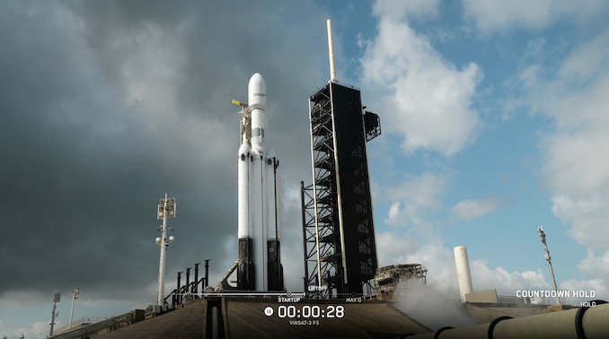

# SpaceX Falcon Heavy Successfully Launches ViaSat-3 F3 Satellite, ~1 Tbps Capacity Sets Global Record

**Summary:** After a weather-related scrub on April 27, SpaceX successfully launched the ViaSat-3 Flight 3 communications satellite aboard a Falcon Heavy rocket from NASA's Kennedy Space Center on April 28 (UTC). This marks the Falcon Heavy's first mission since late 2024, and ViaSat-3 F3 — the final satellite in the ViaSat-3 constellation — maintains the record for the world's highest-capacity communications satellite at approximately 1 Tbps.

*Credit: Spaceflight Now*

## Mission Overview

The Falcon Heavy lifted off from Launch Complex 39A at NASA's Kennedy Space Center, delivering the ViaSat-3 Flight 3 communications satellite to a geostationary transfer orbit (GTO). This was the 12th flight of a Falcon Heavy, and the rocket's first launch since late 2024.

Mission profile:

- **Vehicle:** Falcon Heavy (first flight in approximately 18 months)
- **Payload:** ViaSat-3 Flight 3 (the third and final satellite in the ViaSat-3 series)
- **Target orbit:** Geostationary transfer orbit (GTO); satellite will use its electric propulsion to reach geostationary orbit (GEO)
- **Launch site:** NASA's Kennedy Space Center, LC-39A
- **Booster recovery:** Side boosters (B1075 and B1072) landed vertically for reuse; core booster B1098 expended in the Atlantic Ocean

## From Weather Scrub to Successful Launch

The original launch attempt on April 27 (UTC) was cancelled due to lightning activity and tornado warnings near the launch complex. SpaceX activated a backup window and successfully completed the launch on April 28. Dave Abrahamian, mission director at Viasat, previously stated: "This really is the end of an era for us. We have been working on this project for more than a decade."

The ViaSat-3 constellation is designed to provide high-speed broadband internet service to the Americas. The first two satellites (Flights 1 and 2) were launched in May 2023 and May 2024, respectively.

## ViaSat-3 F3: World's Highest-Capacity Communications Satellite

ViaSat-3 F3 was built by Boeing using the 702MP+ satellite platform with a fully electric propulsion system. The satellite has a launch mass of approximately 6 tonnes with a solar wing span of 44 meters — one of the largest solar arrays ever deployed in space. With a communications capacity of approximately 1 Tbps (125 GB/s), ViaSat-3 F3 holds the record for the world's highest-capacity communications satellite in orbit. It has a design life of 15 years and will provide high-speed broadband service to the Americas.

## Background: Falcon Heavy Returns

Falcon Heavy is SpaceX's most powerful rocket, consisting of three Falcon 9 first-stage boosters mounted together. Its two side boosters are capable of vertical landing and reuse. The rocket is widely used for commercial communications satellites, government payloads, and deep space missions. This launch kicks off a busy period for Falcon Heavy, with subsequent missions including the ESA Rosalind Franklin Mars rover.

## Sources (original pages)

- [Spaceflight Now: Falcon Heavy ViaSat-3 F3 Launch Coverage](https://spaceflightnow.com/2026/04/27/live-coverage-spacex-to-launch-final-viasat-3-satellite-on-falcon-heavy-rocket/)
