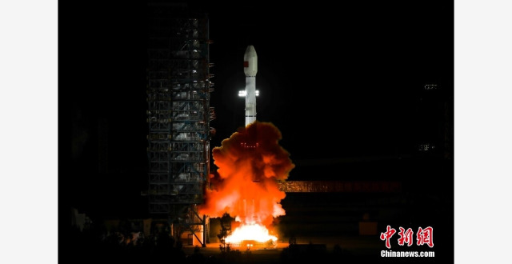

# China Successfully Launches Tianlian-2 05 Data Relay Satellite

**Summary:** On April 27, 2026, China successfully launched the Tianlian-2 05 satellite using a Long March rocket, further improving the Tianlian relay satellite system. The Tianlian relay satellite system is an independently developed satellite communication and tracking system primarily used to provide data relay and TT&C support for crewed spacecraft and satellites.

## Sources (original pages)

- [Tencent News: "Space Metal Additive Manufacturing Technology Demonstrated on Light Ark Test Spaceship" (April 27, 2026)](https://new.qq.com/rain/a/20260427A07Y1P00)
