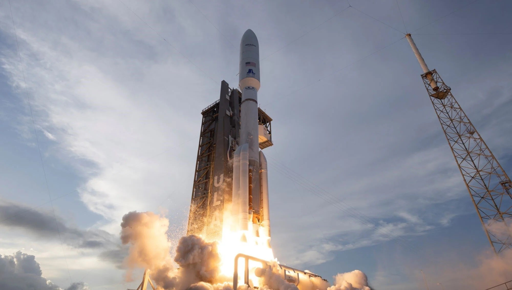

# ULA Atlas V Launches 29 Amazon Kuiper Internet Satellites

**Summary:** United Launch Alliance's Atlas V 551 rocket successfully placed 29 Amazon Project Kuiper internet satellites into low Earth orbit on April 27 at 20:53 EDT (08:53 Beijing Time April 28). This was one of the largest single-launch satellite deployment missions for the Kuiper constellation to date, as Amazon accelerates its competition with SpaceX's Starlink.

*Credit: United Launch Alliance*

## Launch Overview

The mission, designated Kuiper, used an Atlas V 551 configuration (5 solid rocket boosters + 2 liquid oxygen/kerosene engines). The rocket lifted off from Space Launch Complex-41 at Cape Canaveral Space Force Station, deploying all 29 satellites to low Earth orbit approximately 13 minutes after liftoff.

Mission profile:

- **Rocket:** Atlas V 551
- **Payload:** 29 Amazon Project Kuiper satellites (Kuiper Constellation Batch 2)
- **Target orbit:** Low Earth Orbit (LEO)
- **Launch site:** Cape Canaveral SFS LC-41
- **Launch time:** April 27, 20:53 EDT (April 28, 08:53 Beijing Time)

## Kuiper Constellation Deployment Progress

Amazon's Project Kuiper plans to deploy over 3,200 low-Earth-orbit broadband satellites to compete with SpaceX's Starlink in the global satellite internet market. The FCC requires Amazon to complete launching half of its satellites by July 2026.

Previously, ULA launched the Kuiper-1 mission (27 satellites) in April 2025 using an Atlas V 551. This mission was the largest single-launch deployment for the Kuiper constellation to date. According to Kuiper's official website, the plan is to execute multiple launches per week during 2025-2026 to meet FCC deployment milestones.

Additionally, Arianespace's Ariane 64 rocket is scheduled to launch 32 Kuiper satellites later this week from the Guiana Space Centre in French Guiana.

## Background: ULA and Amazon Partnership

ULA is one of the primary launch service providers for Amazon's Kuiper constellation, with a contract reportedly worth billions of dollars. Both ULA's Atlas V and Vulcan Centaur rockets will handle the majority of Kuiper launches. As Vulcan Centaur gradually enters service, the Kuiper launch tempo is expected to increase further.

## Sources (original pages)

- [舜网：亚马逊低地轨道卫星计划又一批卫星发射升空](https://news.e23.cn/guonei/2026-04-28/2026042800285.html)
- [Via Satellite: Amazon Project Kuiper Deployment Begins With First ULA Launch](https://www.satellitetoday.com/launch/2025/04/28/amazon-project-kuiper-deployment-begins-with-first-ula-launch/)
- [Arianespace: OK VA268 Amazon Leo LE-02](https://arianespace.com/)
