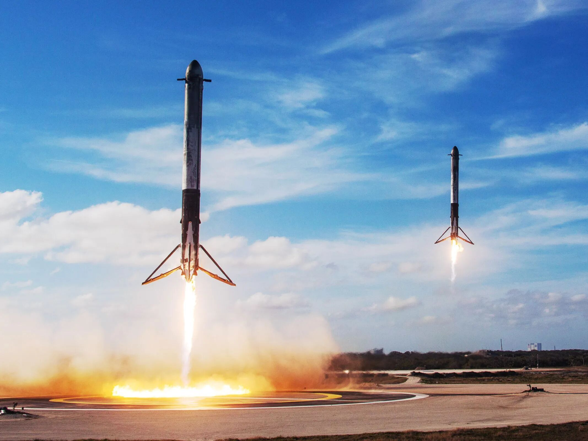

# SpaceX Falcon Heavy Successfully Launches Viasat-3 F3 Satellite

**Summary:** On April 29, 2026 (Beijing Time), SpaceX's Falcon Heavy rocket conducted its 12th mission since 2018, successfully deploying the Viasat-3 ultra-high-throughput communications satellite to orbit. The 27 Merlin engines of the three Falcon boosters ignited at 10:13 AM EDT (14:13 UTC), launching from NASA's Kennedy Space Center Launch Complex 39A.

*Credit: SpaceX*

## Mission Overview

The Viasat-3 F3 communications satellite, weighing approximately 6.6 tonnes, was the primary payload for this mission. The satellite is designed to provide over 1 Terabit per second of network capacity, representing a new generation of ultra-high-throughput communications satellites.

This launch marked Falcon Heavy's first flight since October 2024, when it launched NASA's Europa Clipper mission. The 18-month gap was primarily due to the limited demand for the heavy-lift vehicle's unique capabilities.

## Sources (original pages)

- [腾讯新闻《猎鹰重型时隔1年半再次发射第12次飞行》（2026年4月30日）](https://so.html5.qq.com/page/real/search_news?docid=70000021_54669f2889c05252)
