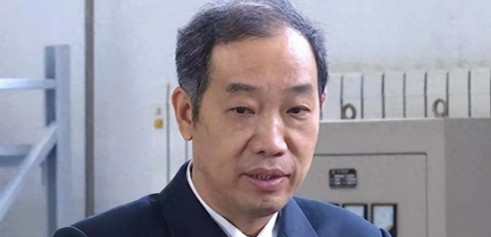

# Academician Ma Weiming Proposes Electromagnetic Launch Track on Qinghai-Tibet Plateau

**Summary:** Chinese Academy of Engineering academician Ma Weiming has proposed a bold concept to build a 2-kilometer electromagnetic launch track on the Qinghai-Tibet Plateau at an average altitude of 4,000 meters, using electromagnetic force to directly 'fling' rockets into space. If realized, this could reduce launch costs by 90% while leveraging the plateau's low atmospheric resistance advantage.

*Concept illustration of electromagnetic launch track (Image source: Internet)*

## Core Concept: 2km Electromagnetic Track to Launch Rockets Directly to Orbit

The core of Ma Weiming's proposal is straightforward: construct a 2-kilometer straight electromagnetic track on the Qinghai-Tibet Plateau at an average altitude of 4,000 meters, using electromagnetic force to accelerate rockets from rest to supersonic speed within just two kilometers. The rocket would then detach from the track and continue flying by igniting its own engines mid-air.

The theoretical advantages are significant. The plateau's thin atmosphere means atmospheric resistance is approximately 40% lower than at sea level, substantially reducing energy consumption during rocket ascent. Combined with the initial velocity provided by electromagnetic launch, rockets would need far less propellant, theoretically cutting launch costs by 90%.

## Technical Foundation: Ma Weiming's Electromagnetic Launch Technology System

Academician Ma Weiming has long been devoted to research in electrical engineering, leading his team to achieve a series of breakthroughs in ship integrated electric power and electromagnetic launch technologies. The medium-voltage DC integrated power system for vessels developed under his leadership has taken China from follower to leader in this field, and the electromagnetic launch system used on the Fujian aircraft carrier is one of his hallmark achievements.

Previously, Ma's team also proposed near-space electromagnetic launch technology — using an airship to carry an electromagnetic launch system and satellite to 30-40 km altitude in near-space, then launching small satellites weighing up to 10 kg directly into low Earth orbit via an approximately 100-meter electromagnetic track at 8 km/s.

## Practical Challenges: Cost and Construction Difficulties

Despite the remarkable theoretical advantages, the proposal faces real-world challenges. The complex terrain of the Qinghai-Tibet Plateau requires enormous investment to build a precision 2-kilometer electromagnetic track, and construction and maintenance difficulties are extremely high. Additionally, electromagnetic launch demands extreme precision in track flatness and magnetic field uniformity — any minor deviation could compromise launch effectiveness.

Experts note that while the concept demonstrates impressive innovative spirit, practical implementation still faces significant hurdles. As materials science and electromagnetic technology continue advancing, this vision may become feasible in the future.

## Sources (original pages)

- [Ma Weiming Proposes Qinghai-Tibet Plateau Electromagnetic Launch Track Concept](https://so.html5.qq.com/page/real/search_news?docid=70000021_31069f102fb73752)
- [New Concept from Ma Weiming: An Electromagnetic Track on the Qinghai-Tibet Plateau to 'Fling' Rockets into Space](https://www.sohu.com/a/1009946350_122407871)
- [Fling Rockets into Space from Qinghai-Tibet Plateau? Launch Costs May Drop 90%](https://www.toutiao.com/article/7628619656659616271/)
- [Ma Weiming's Qinghai-Tibet Plateau Electromagnetic Launch Track: Significant Theoretical Advantages, Substantial Practical Challenges](https://so.html5.qq.com/page/real/search_news?docid=70000021_07569ece98541952)
