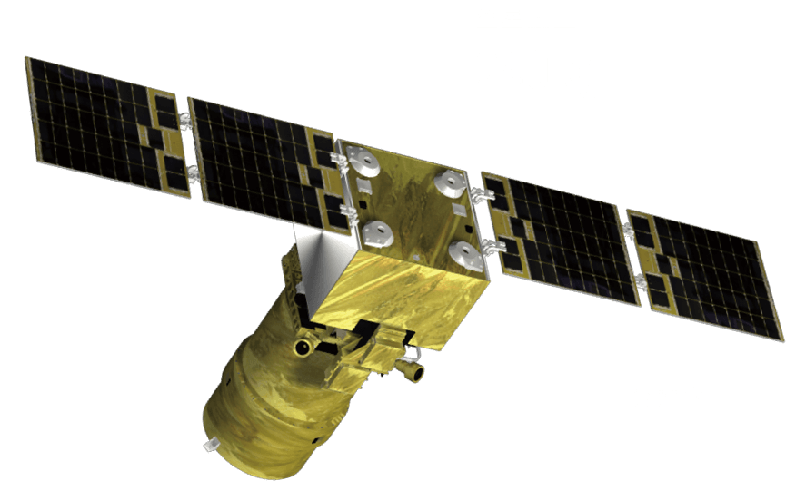

# MicroNano Star Completes IPO Coaching and Acceptance

**Summary:** On April 29, 2026, the China Securities Regulatory Commission's public issuance coaching disclosure system showed that Beijing MicroNano Star Technology Co., Ltd. (referred to as "MicroNano Star") had completed its IPO coaching and acceptance, with Guotai Haotong Securities Co., Ltd. as the coaching institution. MicroNano Star is a leading commercial satellite manufacturing company in China's private aerospace sector, specializing in satellite bus and ground station product R&D and manufacturing. The company began its IPO coaching in September 2025 and completed acceptance approximately 7 months later, marking a critical step toward listing.

*Credit: MicroNano Star Official Website*

## Company Overview

Beijing MicroNano Star Technology Co., Ltd. was established in August 2017 and is headquartered in the Zhongguancun Yongfeng Industrial Base in Beijing. The company is a satellite system technology solutions provider centered on satellite manufacturing. Its main businesses include satellite constellation systems, complete satellite R&D and manufacturing, and satellite in-orbit delivery services.

MicroNano Star is a national-level "specialized, refined, and innovative" enterprise, a national high-tech enterprise, and a unicorn in the commercial aerospace sector. The company has independently developed satellite platforms and core components with proprietary intellectual property, mastering nearly 40 key satellite manufacturing technologies and holding 151 invention patents and 56 software copyrights. The company provides one-stop satellite-to-ground integrated delivery services covering demonstration, design, manufacturing, testing, launch, and TT&C (telemetry, tracking, and command).

## IPO Progress

- **September 2025**: MicroNano Star completed IPO coaching filing with the Beijing Securities Regulatory Bureau, with Guotai Haotong Securities as the coaching institution, officially starting the listing process
- **April 29, 2026**: Completed IPO coaching and acceptance, marking阶段性 progress in the company's listing journey

As of June 2025, MicroNano Star had accumulated over 2 billion yuan in financing, with a company valuation exceeding 7 billion yuan.

## Business and Technical Capabilities

MicroNano Star independently develops micro/nano satellite platforms and core components, possesses complete satellite bus design and integration testing capabilities, has experience in electronic communication and optical payload satellite system development, and has the ability to lead overall coordination and integration. The company has independently developed satellite ground communication terminals and possesses satellite communication system integration experience, capable of providing comprehensive information system solutions based on satellite resources for national defense, industry, and regional users.

The company has participated in multiple satellite launch missions, including launching satellite internet technology test satellites at the Jiuquan Satellite Launch Center using Long March 2C carrier rockets.

## Sources (original pages)

- [CLS (Cailian Press): Commercial Satellite Company MicroNano Star Completes IPO Coaching and Acceptance (April 29, 2026)](https://www.cls.cn/detail/2359207)
- [Tencent News: Commercial Satellite Company MicroNano Star Completes IPO Coaching and Acceptance (April 29, 2026)](https://new.qq.com/rain/a/20260429A04AGG00)
- [East Money: MicroNano Star Completes IPO Coaching and Acceptance](https://caifuhao.eastmoney.com/news/20260429120118338875340)
- [MicroNano Star Official Website](http://www.minospace.cn/)
