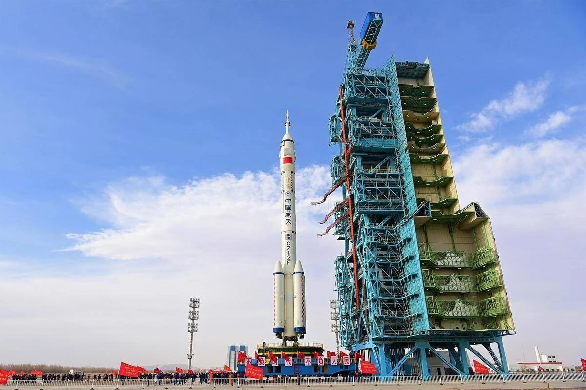

# Shenzhou-23 Launch Countdown Underway as Jiuquan Prepares for Mission

**Summary:** The Shenzhou-23 crewed spacecraft launch mission has entered a critical preparation phase. The Jiuquan Satellite Launch Center has completed key preparations including rocket ground testing and control equipment maintenance, spacecraft fueling drills, and emergency search and rescue exercises. According to mission planning, China will launch Shenzhou-23 and Shenzhou-24 from Jiuquan in 2026, with Shenzhou-22 and Shenzhou-23 spacecraft returning to the Dongfeng landing area in sequence.

*Jiuquan Satellite Launch Center mission control hall (file photo)*

## Launch Site Preparations Complete

On April 24, the 11th China Space Day, scientific and technical personnel at the Jiuquan Satellite Launch Center celebrated their special holiday by orderly advancing preparations for Shenzhou-23 and other missions.

In the launch center's mission control hall, various equipment indicator lights flashed alternately as dense parameters refreshed in real time on screens. Rocket system commanders intently monitored every set of data, precisely issuing each command with fingertip precision on the control panel.

## Shenzhou-21 Crew Extended Stay

Notably, the Shenzhou-21 astronaut crew was originally planned to return to Earth in late April. However, after completing their third extravehicular activity (EVA), based on sufficient space station material reserves and the crew's good health condition, a comprehensive assessment decided to extend the crew's orbital residence time by approximately one month. This means the Shenzhou-23 launch window will shift from late April to late May to early June.

The 2026 plan calls for two crewed flight missions and one cargo spacecraft resupply mission. Shenzhou-23 and Shenzhou-24 will launch from Jiuquan in sequence, with Tianzhou-10 also included in the annual mission schedule.

## Sources (original pages)

- [酒泉卫星发射中心全力备战神舟二十三号等任务](https://wallstreetcn.com/livenews/3093816)
- [神舟二十三号发射任务备战中](https://www.sohu.com/a/1015165883_122377242)
- [神舟二十三号蓄势待发：乘组调整引期待 神二十四火箭提前就位](https://www.sohu.com/a/1015649441_362225)
- [神舟二十三号发射准备中：3人乘组有变，神二十四火箭已到发射场](https://so.html5.qq.com/page/real/search_news?docid=70000021_51969f0d6db35452)
