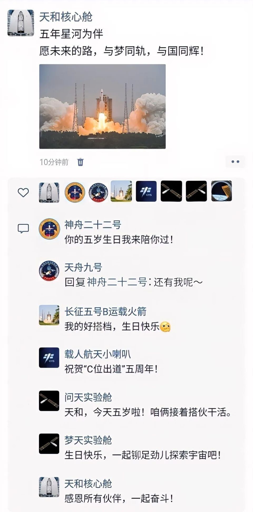

# Tianhe Core Module Marks Five Years of Stable Operation, China's Space Station Yields Rich Scientific Returns

**Summary:** On April 29, 2026, the Tianhe Core Module of China's Tiangong Space Station celebrated five years of stable in-orbit operation. As the first module of China's space station, Tianhe has witnessed the docking of the Wentian and Mengtian laboratory modules, hosted 11 Shenzhou crewed spacecraft and 8 Tianzhou cargo vehicles, and welcomed 25 Chinese astronauts. Over five years, 267 scientific experiments have been conducted, more than 450TB of data collected, with several outcomes representing world firsts and already transitioned to practical applications.

*Credit: Our Space / China Manned Space Engineering Office*

On April 29, 2021, the Long March 5B Y2 carrier rocket lifted off from the Wenchang Spacecraft Launch Site in Hainan, carrying the Tianhe Core Module into orbit. This marked the beginning of China's own space station construction, delivering the first "building block" of the "Tiangong" (Heavenly Palace) space station to space.

## Five Years of Remarkable Achievements

Over the past five years, the Tianhe Core Module — the "veteran" of China's Tiangong Space Station — has witnessed the docking and relocation of the Wentian and Mengtian laboratory modules, continuously providing a comfortable environment for scientific research and living for astronauts, supporting long-duration orbital habitation.

According to data published by the China Manned Space Engineering Office:

- **11** Shenzhou crewed spacecraft dockings
- **8** Tianzhou cargo vehicle arrivals
- **25** Chinese astronauts received
- **267** scientific experiments deployed and conducted on orbit
- **450TB+** of scientific data accumulated
- **9** batches of experimental samples returned to Earth

These figures fully demonstrate the progression of China's space station from construction to stable operation, laying a solid foundation for future long-duration deep space exploration.

## Multiple World-First Achievements

Notably, several scientific achievements from the past five years represent world firsts and have already been transitioned to practical applications. The space station's role as a national space laboratory is becoming increasingly prominent, providing a unique platform for cutting-edge research in materials science, microgravity biomedical science, space physics, and other fields.

## 2026 Mission Outlook

This year, China's space station will carry out **1** cargo resupply mission and **2** crewed launch missions, including:

- First flight of Hong Kong and Macau astronauts
- Shenzhou-23 mission, featuring **China's first year-long astronaut residence experiment on orbit**

China's manned space program is advancing steadily, with the goal of achieving China's first lunar landing before 2030.

## Sources (original pages)

- [Tianhe Core Module 5th Anniversary Results Overview (Our Space)](https://www.toutiao.com/article/7634032414745952831/)
- [Tianhe Core Module 5th Anniversary, China's Space Station Achievements Abundant (DoNews)](https://www.donews.com/news/detail/8/6535526.html)
- [Targeting 2030 for Lunar Landing! China's Manned Lunar Program Progressing Smoothly (Sohu)](https://www.sohu.com/a/1016154451_114760)
