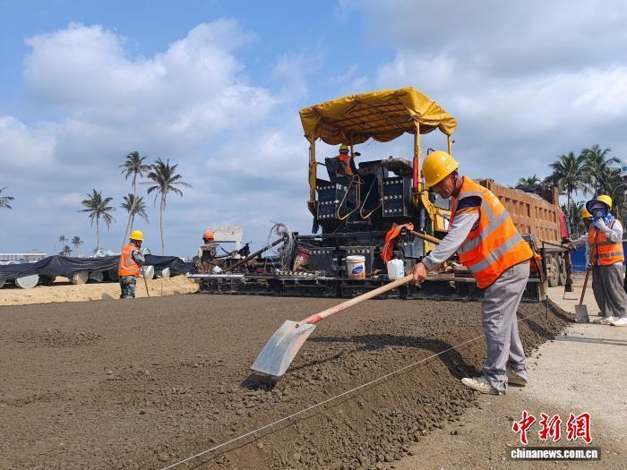

# Hainan Commercial Spaceport Phase II Enters Final Sprint, Launch Pad 3 Over 80% Complete

**Summary:** On May 1st, Labor Day, China's first commercial space launch site — the Hainan Commercial Spaceport Phase II project — was bustling with activity. Hundreds of construction workers stayed on the job, advancing the Launch Complex 3. The lightning tower has completed its 8th section installation, two prefab equipment buildings have topped out with partial equipment already in place, and overall progress exceeds 80%. The project is expected to complete key milestones by the end of May. Once Pads 3 and 4 are finished, the spaceport's annual launch capacity will exceed 60 missions.

*Credit: China Construction 5th Bureau (authorized for use)*

## Sources (original pages)

- [People's Daily / Tencent News: Hainan Commercial Spaceport Key Projects Accelerate](https://new.qq.com/rain/a/20260501A059E300)
- [Phoenix Finance: Hainan Governor Inspects Commercial Spaceport During Labor Day](https://finance.ifeng.com/c/8smCHRULZaV)
- [Toutiao: Video - Major Projects Continue Advancing During Holiday](https://www.toutiao.com/article/7634813731574202914/)
- [Yunnan Net: Multiple National Projects Continue Updating Progress During Holiday](https://news.yunnan.cn/system/2026/05/01/033991196.shtml)
