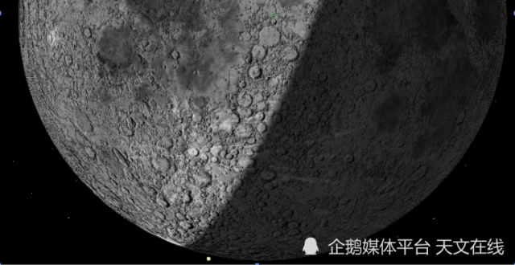

# SpaceX Falcon 9 Derelict Upper Stage Set for Lunar Impact on August 5: Scientists Warn of Deep-Space Debris Crisis

**Summary:** Astronomers have confirmed that a defunct SpaceX Falcon 9 upper stage will impact the Moon near Einstein Crater on August 5, 2026, traveling at approximately 2.43 km/s (about 7 times the speed of sound). The debris, designated 2025-010D, originated from the January 2025 launch of Firefly Aerospace's Blue Ghost Mission 1 lunar lander, and has been drifting in orbit for roughly 18 months. The impact site lies near the boundary between the Moon's near and far sides, potentially observable from Earth, though the brightness may fall short of the 2009 NASA LCROSS mission impact.

*Image: Getty Images / Illustration*

## Background: The Unexpected Fate of a Spent Rocket Stage

On January 15, 2025, SpaceX's Falcon 9 rocket delivered Firefly Aerospace's Blue Ghost Mission 1 lunar lander into space. The lander successfully touched down in the Moon's Mare Crisium (Sea of Crises) on March 2, 2025, achieving the world's first fully successful commercial lunar soft landing and setting a record for the longest operational duration of a commercial spacecraft on the lunar surface.

However, the Falcon 9 upper stage that injected Blue Ghost into its trans-lunar trajectory did not execute a controlled deorbit as planned. Instead, it entered an unstable orbit and has been drifting through space ever since. This 13.8-meter (45-foot) tall, 3.7-meter (12-foot) diameter upper stage is now on a collision course with the Moon — with no active control to prevent it.

## Impact Prediction: Orbital Science to the Second

The orbital calculations were performed by Bill Gray, developer of the widely used "Project Pluto" celestial tracking software, which is employed by professional and amateur astronomers worldwide for monitoring asteroids, comets, and near-Earth objects. Gray has accumulated 1,053 tracking observations through a global network of astronomical observations, arriving at the following precise impact parameters:

- **Impact Time**: August 5, 2026, at 2:44 AM EDT (06:44 UTC), or 14:44 Beijing time on August 5
- **Impact Velocity**: Approximately 2.43 km/s (~8,700 km/h, or 7 times the speed of sound)
- **Impact Location**: Near Einstein Crater on the lunar farside-nearside boundary
- **Debris Designation**: 2025-010D

Because the Moon has no atmosphere, this rocket upper stage will strike the surface intact, without the atmospheric burn-up that would occur during an Earth reentry.

## Will It Be Visible from Earth? Brightness May Fall Short of LCROSS

Gray told Space.com that this artificial lunar impact has a reasonable chance of being observable from Earth. From Earth's perspective, the impact site lies near the lunar limb (edge), in a sunlit region of the Moon, with more than half of the visible lunar disk illuminated at the time.

However, Gray also recalled the outcome of NASA's 2009 Lunar Crater Observation and Sensing Satellite (LCROSS) mission, where a Centaur upper stage was deliberately crashed into a permanently shadowed lunar pole crater. Scientists had expected to clearly observe the resulting debris plume, but ultimately no significant impact signature was detected from Earth.

Gray believes this impact's brightness will likely fall well short of the LCROSS event. Compounding the difficulty, this impact will occur in a sunlit region rather than the dark shadowed zone targeted by LCROSS, making the contrast between impact flash and background illumination much lower.

## The Space Debris Crisis: A Growing Concern

This is not the first time a spent rocket stage from human spaceflight has struck the Moon. In March 2022, a SpaceX Falcon 9 upper stage impacted the lunar farside, creating a new crater. This recurring pattern underscores the emerging crisis of orbital debris management in the cislunar space.

As SpaceX's Starlink constellation surpasses 10,000 operational satellites, and as Blue Origin, Rocket Lab, and other companies continue high-frequency launches — with nations worldwide deploying large commercial satellite constellations — the question of managing and regulating deep-space orbits has become increasingly urgent.

## Sources (Original Articles)

- [SpaceX废弃火箭上面级将于8月5日撞击月球 - DoNews](https://www.donews.com/news/detail/8/6536857.html)
- [今年8月，SpaceX废弃猎鹰9号火箭上面级将撞击月球 - IT之家](https://www.ithome.com/0/945/218.htm)
- [猎鹰火箭将执行撞击月球的既定任务 - 新浪财经](https://finance.sina.com.cn/tech/digi/2026-04-29/doc-inhwesky6658722.shtml)

> Republished with attribution: Tianjiangshuo / cislunarspace.cn
