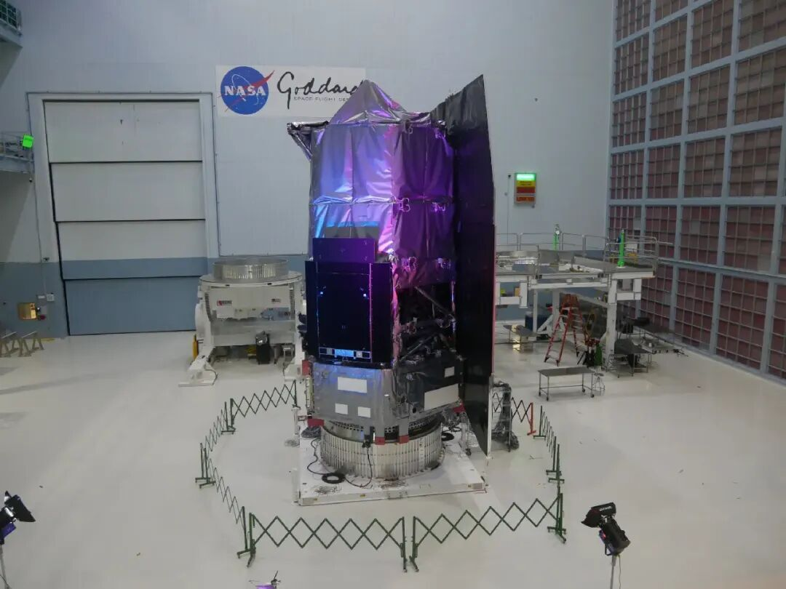

# NASA's Nancy Grace Roman Space Telescope Completes Assembly, Set for September Launch

**Summary:** NASA announced on April 21, 2026, that its next-generation flagship observatory — the Nancy Grace Roman Space Telescope — has completed full assembly and testing. The $4.3 billion deep-space observatory, featuring a 12-meter-long structure and a 2.4-meter primary mirror matching Hubble's, is scheduled to launch in September 2026 aboard a SpaceX Falcon Heavy rocket from Kennedy Space Center, tasked with mapping cosmic structure, hunting exoplanets, and probing dark energy and dark matter.

*Image credit: NASA Goddard Space Flight Center (Public Domain)*

On April 21, 2026, NASA held a press conference at the Goddard Space Flight Center to unveil the fully assembled Roman Space Telescope. Named after NASA's first chief astronomer Nancy Grace Roman, the observatory features a 12-meter-long body with tall orange solar arrays and a gleaming base. Its wide-field infrared instrument provides a field of view 100 times larger than Hubble's infrared instruments, capable of surveying an area of sky equivalent to 100 full moons in a single observation.

According to NASA, the Roman Space Telescope will operate in a halo orbit near the Sun-Earth L2 Lagrange point. Its three primary science objectives include mapping the large-scale structure of the universe to study dark energy, searching for and characterizing exoplanets (including direct imaging), and peering through dust clouds to observe the galactic center.

The telescope is scheduled to launch in September 2026 aboard a SpaceX Falcon Heavy rocket from Kennedy Space Center's Launch Pad 39A. NASA selected SpaceX for this launch in July 2022, awarding a contract worth approximately $255 million. This mission will mark Falcon Heavy's first launch of a NASA flagship-class science payload.

## Sources (original pages)

- [Roman Space Telescope Assembly Complete, Launch Set for September (Tencent News, April 22, 2026)](https://so.html5.qq.com/page/real/search_news?docid=70000021_46369e8e65b25752)
- [NASA Roman Space Telescope Unveiled (Tencent News, April 25, 2026)](https://so.html5.qq.com/page/real/search_news?docid=70000021_20369ec245508052)
- [NASA Official: Nancy Grace Roman Space Telescope](https://www.nasa.gov/)
