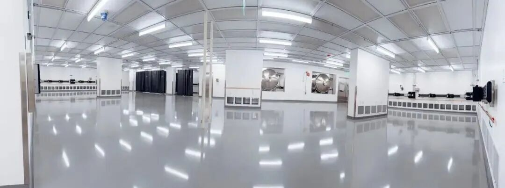

# Hainan Commercial Spaceport Phase 2 Construction Accelerates, Launch Pad 3 Over 80% Complete

**Summary:** During the 2026 May Day holiday, construction continued non-stop at the Hainan Wenchang Commercial Spaceport Phase 2 site, with numerous workers on duty. As a key pillar of China's aerospace power strategy and the country's first commercial launch site, Phase 2's Launch Pad 3 has exceeded 80% overall progress. The lightning tower has completed its eighth section installation, both pre-positioned equipment buildings have fully topped out, and two 400-cubic-meter liquid oxygen storage tanks have been hoisted into place and passed acceptance. Once Launch Pads 3 and 4 are completed, all four pads will be operational with a designed annual launch capacity of 60 missions.

The Wenchang Commercial Spaceport is China's first dedicated commercial launch facility, having achieved its "0 to 1" inaugural launch breakthrough. Upon Phase 2 completion, it will serve as the core hub for China's high-frequency commercial space launches. Each liquid oxygen storage tank holds 400 cubic meters of liquid oxygen and must ensure seal integrity and thermal insulation amid Hainan's hot climate — critical for supporting high-density launch operations. Per design plans, the facility will enable "launch-on-demand" operations, targeting one launch per week.

Meanwhile, Shanghai's commercial aerospace industry also reached a new milestone. On April 30, 2026, Shanghai Commercial Aerospace Offshore Launch Technology Co., Ltd. was officially established with a registered capital of 1.1 billion yuan, forming a full-industry-chain closed loop.

## Sources (original pages)

- [CCTV News: Hainan Commercial Spaceport Construction](https://new.qq.com/rain/a/20260503A0206P00)
- [Tencent: Shanghai Offshore Launch Company Established](https://so.html5.qq.com/page/real/search_news?docid=70000021_76669f4441950752)
