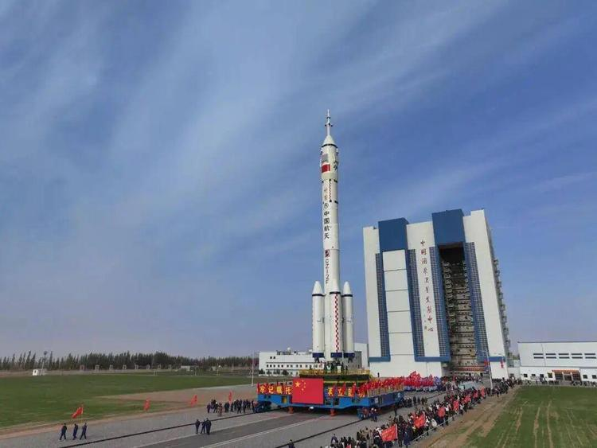

# Pakistani Astronauts Photographed Wearing Chinese Space Suits: 'Feitian' Intravehicular Suit Makes an Impressive Debut

**Summary:** As preparations for the Shenzhou-23 mission enter their final phase, two Pakistani astronauts — Muhammad Zeeshan Ali and Khurram Daud — have been photographed wearing China's domestically developed "Feitian" intravehicular spacesuit. The image shows the two Pakistani astronauts in pristine white Chinese spacesuits, with Shenzhou mission patches on their chests and Pakistan's national flag on their arm patches. The sight not only demonstrates the deep cooperation between China and Pakistan in crewed spaceflight but also highlights the international recognition of Chinese space equipment.

*Pakistani astronauts Muhammad Zeeshan Ali (left) and Khurram Daud (right) pose in China's "Feitian" intravehicular spacesuit. The caption reads "Pioneers of Pakistan's First Crewed Spaceflight Mission."*

## The "Feitian" Intravehicular Spacesuit: Standard Equipment for Chinese Astronauts

In the photographs that have been released, the two Pakistani astronauts are wearing China's domestically developed **intravehicular spacesuit** (known as the "Feitian" or "Flying into Space" suit). This spacesuit is a crucial component of China's crewed space program, specifically designed for the spacecraft cabin environment, with the following features:

- **Safety**: The intravehicular spacesuit can provide life support for astronauts in emergency situations such as cabin gas leaks or abnormal pressure, ensuring their survival in a vacuum environment
- **Comfort**: Designed with ergonomics in mind, suitable for astronauts to wear and operate in for extended periods
- **Full Functionality**: Equipped with communication and monitoring systems, facilitating various operations and communications inside the cabin
- **Chinese Characteristics**: The suit features the Chinese national flag and Shenzhou mission emblem, with a dedicated mission patch on the chest and arm patches displaying the astronaut's country

The spacesuits in the photographs appear pristine white and well-tailored, fully showcasing the exquisite craftsmanship and high standards of Chinese space equipment manufacturing.

## Pakistani Astronauts: Military Elites Who Stood Out

The two Pakistani astronauts wearing Chinese spacesuits are:

- **Muhammad Zeeshan Ali**: A Pakistan Air Force Lieutenant Colonel with extensive military flight experience and an accomplished fighter pilot
- **Khurram Daud**: A Pakistan Navy Lieutenant Colonel, also with solid flight expertise and a background in engineering and physics

Both individuals were selected through rigorous screening by the China-Pakistan joint selection committee, standing out from numerous candidates. The selection process covered physical tests, psychological assessments, professional skill evaluations, and flight record reviews, ultimately identifying these two candidates with composite qualities as reserve astronauts for China's space station missions.

Notably, the photograph bears the captions **"Pioneers of Pakistan's First Crewed Spaceflight Mission"** and **"Meet the Astronaut Candidates,"** highlighting the special status of these two astronauts in Pakistan's space history.

## China-Pakistan Space Cooperation: From "Iron Brotherhood" to Space Partners

On April 24, 2026, the 11th "China Space Day," two Pakistani astronauts officially entered the China Astronaut Research and Training Center to train alongside Chinese astronauts. This marks the first time in China's crewed space program history that foreign astronauts have participated in training, carrying epoch-making significance.

According to the agreement between China and Pakistan:

- The two astronauts will complete approximately 6 months of various training programs in China
- Training covers core subjects including spacecraft operations, space environment adaptation, Chinese language learning, weightlessness training, and mission coordination
- After training and passing examinations, one will be selected as a **payload specialist** to board a Shenzhou spacecraft bound for the Tiangong Space Station
- The expected mission time is October to November 2026, with an orbital stay of approximately one week to conduct Pakistani scientific experiments

China's Manned Space Engineering Office stated that this is a vivid demonstration of the China-Pakistan all-weather strategic cooperative partnership in the space sector and an important milestone in China's space station opening to the world. The Pakistan Space and Upper Atmosphere Research Commission (SUPARCO) also noted that this would be a historic moment for Pakistan's space endeavors.

## Chinese Space Suits Going International: A New Name Card for Open Cooperation

The appearance of Pakistani astronauts wearing Chinese space suits is powerful evidence of international recognition of Chinese space equipment.

For a long time, global astronaut clothing and equipment has been dominated by Russia ("Soyuz" spacesuits) and the United States (shuttle-era suits). The exposure of China's "Feitian" spacesuit showcases the maturity and confidence of Chinese space technology to the world.

Judging from the photographs, the two Pakistani astronauts look handsome and spirited in Chinese spacesuits, blending seamlessly with Chinese astronauts. As one internet user commented: "If it weren't for the Pakistani national flag, you might even think these are our own Chinese astronauts."

This not only reflects the profound friendship between the two countries' astronauts but also foreshadows that Chinese space equipment may become the choice for more nations in future crewed space missions.

## Shenzhou-23 Mission Prospects: Pakistani Astronauts May Have Their Chance

According to the latest developments in the Shenzhou-23 mission, the spacecraft is expected to launch in May 2026. At that time, the Shenzhou-23 crew will "rendezvous in space" with the currently orbital Shenzhou-21 crew.

Regarding whether Pakistani astronauts will participate in the Shenzhou-23 mission, official information has not yet been announced. However, informed sources reveal whether foreign astronauts will be part of the Shenzhou-23 crew remains to be officially released. Meanwhile, the Shenzhou-24 crewed spacecraft has entered a standby state, adopting a "rolling backup" mode to ensure mission safety.

Regardless of which spacecraft ultimately carries them, Pakistani astronauts will have the opportunity to realize the spaceflight dreams of the Pakistani people and bring the traditional China-Pakistan friendship into space.

## Outlook: A New Chapter in China's International Space Cooperation

Since its establishment, China's Tiangong Space Station has consistently adhered to the principles of "peaceful utilization, equality and mutual benefit, and common development," actively carrying out international cooperation. The participation of Pakistani astronauts marks a solid step in the internationalization process of China's space station.

Looking ahead, China's crewed space program will continue to open to the world, providing opportunities for various countries to participate in Tiangong Space Station missions. As China's Manned Space Engineering Office stated: "China is willing to work together with the international community to jointly explore the mysteries of the universe and share the achievements of space development."

The photograph of Pakistani astronauts wearing Chinese space suits is not only a handsome group portrait but also a historical witness to China-Pakistan space cooperation. We look forward to seeing Pakistani astronauts truly set foot in the Tiangong Space Station in the near future, writing a new chapter in China-Pakistan friendship in the vast cosmos.

---

## Sources

- [Sohu News: Shenzhou-23 Prepares for Launch, 2 Foreign Astronauts Don Chinese Spacesuits](https://www.sohu.com/a/1016630050_100158206)
- [NetEase News: Pakistani Astronauts Photographed Wearing Chinese Spacesuits, Shenzhou-23 Departs for Space in May](https://c.m.163.com/news/a/KS0I8GE90527F7K3.html)
- [CCTV News: First Batch of Foreign Astronauts Arrive in China for Training](https://www.toutiao.com/article/7632499072347390470/)
- [Huanqiu Times: Fulfilling Space Dreams! Pakistani Astronauts Train in China](https://www.toutiao.com/article/7632456416304972330/)
