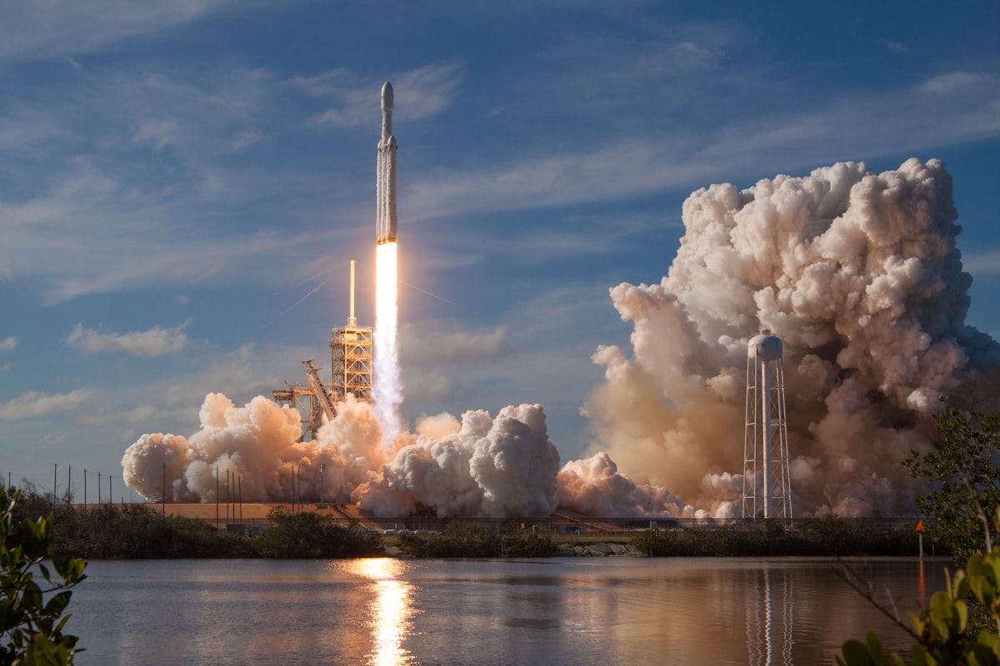

# SpaceX Plans Largest Ever IPO at $1.75 Trillion Valuation

**Summary:** SpaceX is expected to launch its IPO, codenamed "Apex," around June 2026, targeting a $1.75 trillion valuation with a $75 billion fundraising round — poised to surpass Saudi Aramco as the largest IPO in history. A consortium of 21 top investment banks will underwrite the offering, with Morgan Stanley handling retail distribution, while Musk plans to allocate 30% of shares to retail investors.

SpaceX's valuation has climbed from $800 billion during internal share transfers in December 2025, to $1.25 trillion following the xAI merger in February 2026, and now targeting $1.75 trillion — more than doubling within four months. The company's「dual-wheel drive」valuation model rests on two pillars: traditional rocket launch services generated approximately $3 billion in revenue in 2025 with gross margins exceeding 40%, while Starlink satellite internet reached 8.2 million active subscribers across 82 countries by March 2026, projected to contribute $20 billion in 2026 revenue — over 85% of total company revenue.

Musk simultaneously revealed his personal compensation plan tied to Mars colonization — establishing a self-sustaining city for at least 1 million residents on Mars, which if achieved alongside SpaceX reaching a $7.5 trillion market cap, would propel his personal fortune past $1.5 trillion. SpaceX filed a confidential registration statement with the SEC on April 29, 2026.

## Sources (original pages)

- [Sina Finance: SpaceX $1T IPO](http://k.sina.com.cn/article_7857201856_1d45362c001904xs2i.html)
- [Toutiao: Musk's Mars KPI Revealed](https://www.toutiao.com/w/1863996513273930/)
- [Sohu: Why Wall Street Backs SpaceX IPO](https://www.sohu.com/a/1016533350_472773)
