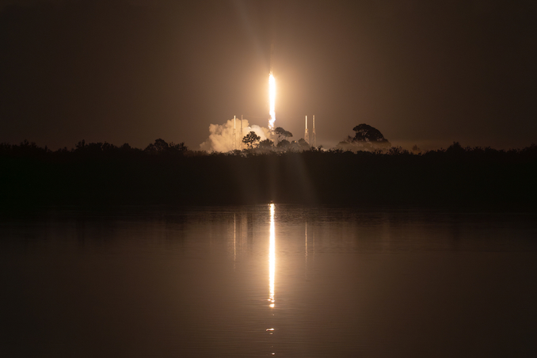

# SpaceX Launches 29 Starlink Satellites from Cape Canaveral in Pre-Dawn Jellyfish Display

**Summary:** SpaceX successfully launched 29 Starlink V2 Mini Optimized satellites from Cape Canaveral Space Force Station before sunrise on May 21 EDT (10:04 UTC). The pre-dawn launch created a spectacular "jellyfish effect" as the rocket plume was illuminated by early morning light, visible across the US East Coast. This was SpaceX's 46th Starlink mission of 2026, adding to a constellation that now exceeds 10,000 active satellites.

## Mission Profile

- **Launch time**: May 21, 2026, 06:04 EDT (10:04 UTC)
- **Launch site**: Space Launch Complex 40 (SLC-40), Cape Canaveral Space Force Station
- **Payload**: 29 Starlink V2 Mini Optimized satellites
- **Mission**: Starlink 10-31
- **Trajectory**: North-easterly flight path
- **Orbit**: Low Earth Orbit (LEO)

The Falcon 9 rocket lifted off in darkness approximately 20 minutes before sunrise, with the rocket's exhaust plume illuminated by early morning light as it arced across the sky. The payload fairing separation occurred shortly after stage separation, creating the signature "jellyfish effect" that was visible to observers along the US East Coast.

## Weather Conditions

The 45th Weather Squadron forecast a 90% probability of favorable weather conditions at liftoff. The primary weather concern was a slow-moving disturbance over the Bahamas, which was expected to supply moisture and potentially generate convective clouds during the early morning hours. Launch weather officers noted this as the main risk factor for violating weather constraints for both the primary and backup launch windows.

## Mission Context

The Starlink 10-31 mission was SpaceX's 46th Starlink launch of 2026, contributing to a constellation that now consists of more than 10,000 active satellites. On the same calendar day, SpaceX also launched 24 Starlink satellites from Vandenberg Space Force Base in California (Starlink 17-42), bringing the combined daily total to 53 Starlink satellites deployed in a single day.

SpaceX confirmed satellite deployment at 7:36 a.m. EDT (11:36 UTC) on May 21.

## Sources (original pages)

- [Spaceflight Now: SpaceX's sunrise Starlink launch adds 29 satellites to low Earth orbit megaconstellation](https://spaceflightnow.com/2026/05/20/live-coverage-spacex-to-launch-29-starlink-satellites-on-falcon-9-rocket-from-cape-canaveral-13/)
