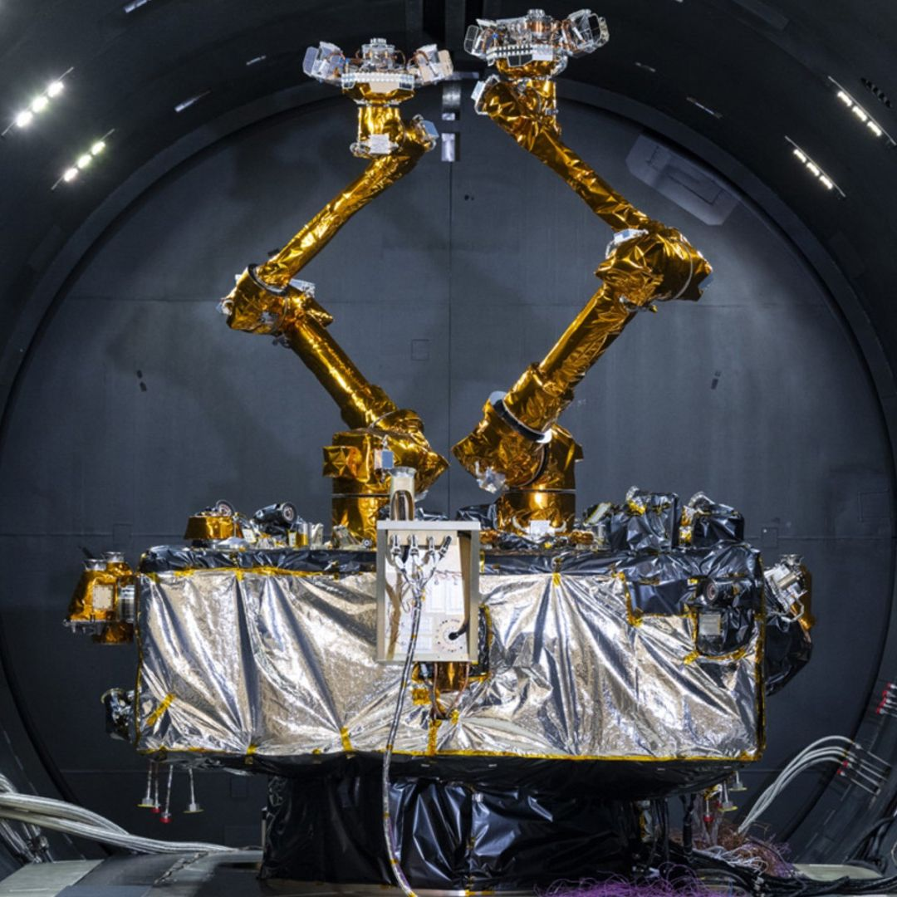

# DARPA's Geosynchronous Satellite Servicing Mission Targets Summer 2026 Launch

**Summary:** The U.S. Defense Advanced Research Projects Agency (DARPA) announced on May 20, 2026, that its long-delayed Robotic Servicing of Geosynchronous Satellites (RSGS) payload has completed integration and cryogenic thermal vacuum testing, targeting launch as soon as summer 2026. The mission will demonstrate dexterous robotic servicing, upgrades, inspections, and satellite relocation at geostationary orbit (GEO) approximately 22,000 miles (36,000 km) above Earth — a milestone that could shift space operations from a "disposable assets" model to one of sustainable maintenance and upgradability.

## Background

Geostationary satellites orbit at roughly 36,000 kilometers above Earth — a sweet spot where their orbital velocity precisely matches Earth's rotation, allowing them to maintain continuous coverage of one区域. These satellites are the backbone of communications, weather monitoring, and national security infrastructure.

However, GEO satellites have few options when they run out of fuel besides being maneuvered out of orbit and replaced. With collision risks rising due to large low Earth orbit (LEO) constellations, the need for on-orbit servicing at GEO has become increasingly urgent.

## Technical Capabilities

The heart of the RSGS mission is a "highly dexterous robotic servicing suite" that DARPA says will be able to perform several critical tasks:

- **On-orbit upgrades**: Installing new hardware or software to extend satellite operational life
- **Inspections and diagnostics**: Conducting detailed assessments of satellite health
- **Anomaly resolution**: Repairing mechanical or electronic faults
- **Satellite relocation**: Adjusting orbital positions or performing collision avoidance maneuvers

## Project History

RSGS was first announced in 2017, with then-prime contractor Maxar Technologies leaving the project in 2019. The global pandemic then disrupted industry supply chains. Current prime contractor SpaceLogistics, a Northrop Grumman subsidiary, faced integration challenges with the DARPA payload on their spacecraft.

Other RSGS participants include NASA and the U.S. Naval Research Laboratory. Together with its partners, DARPA aims to ensure the robotic servicer can "adapt to a variety of on-orbit missions and conditions" safely and efficiently.

## Strategic Significance

A typical geostationary satellite lasts about 15 years, compared to roughly 5 years for a LEO operator like SpaceX Starlink. But with GEO satellites costing hundreds of millions of dollars to launch, on-orbit servicing offers compelling economic value.

"By transitioning from a paradigm of disposable space assets to one of sustainable, upgradable, and resilient satellites, RSGS aims to fundamentally alter space operations for both the public and private sectors," DARPA officials stated.

The agency also faces competition from companies like Japan's Astroscale in the growing field of space servicing. A successful RSGS mission would open a new industry pathway for the long-term economic operation of GEO satellites.

## Launch Plans

Assuming an on-time launch, RSGS will be delivered to geostationary transfer orbit before climbing to GEO to begin its demonstration mission.

## Sources (original pages)

- [Space.com: DARPA readies robotic deep-space repair satellite for 2026 launch](https://www.space.com/space-exploration/satellites/darpa-readies-robotic-deep-space-repair-satellite-for-2026-launch)
