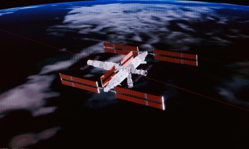

# Shenzhou 23 Successfully Docks with Tiangong Space Station

**Summary:** On May 25, 2026, China's Shenzhou 23 spacecraft successfully docked with the Tiangong Space Station's Tianhe core module at the radial port, after a 6.5-hour fast rendezvous from launch. The crew — commander Zhu Yangzhu, pilot Zhang Zhiyuan, and payload specialist Liao Jiaying — then entered the station, meeting the Shenzhou 21 crew already aboard.

Shenzhou 23 launched from the Jiuquan Satellite Launch Center at 11:08 a.m. EDT (1508 GMT; 11:08 p.m. Beijing Time) on May 24 atop a Long March 2F rocket. After six orbital maneuvers, the spacecraft completed autonomous fast rendezvous and docking with Tiangong at approximately 11:00 a.m. Beijing Time on May 25.

Following the docking, the three astronauts boarded the station one by one, officially beginning their long-duration mission aboard Tiangong. The Shenzhou 21 crew had completed all preparations to receive the new team, and the two crews held a brief handover ceremony in orbit.

This mission marked the first use of a 6.5-hour fast rendezvous profile for Shenzhou spacecraft, a significant improvement over the previous 2-day timeline for Shenzhou dockings with the station. The faster approach reduces astronaut fatigue and improves overall mission efficiency.

The Shenzhou 23 crew will spend approximately one year aboard Tiangong, conducting scientific experiments, technology demonstrations, and extravehicular activities. Liao Jiaying, the payload specialist, is from Hong Kong and became China's first astronaut to travel to space from the SAR.

## Sources (original pages)

- [China Manned Space Engineering (CMSE) - Shenzhou 23 Docking](http://www.cmse.gov.cn/xwzx/202605/t20260525_57566.html)
- [Space.com - China launches 3 astronauts, including 1st ever from Hong Kong, to Tiangong space station](https://www.space.com/space-exploration/human-spaceflight/china-shenzhou-23-astronaut-launch-tiangong-space-station)
