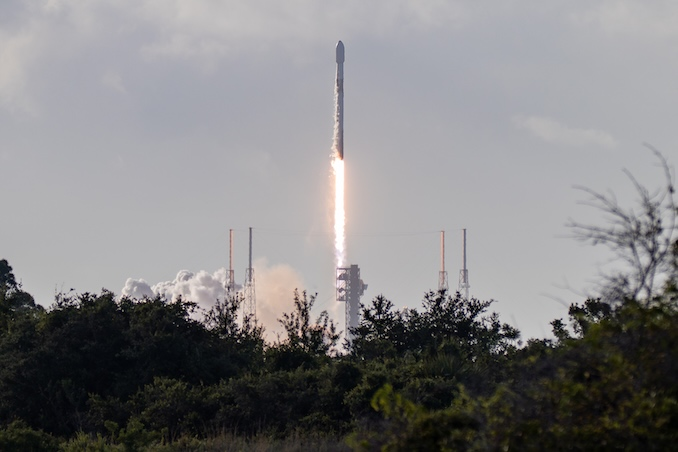
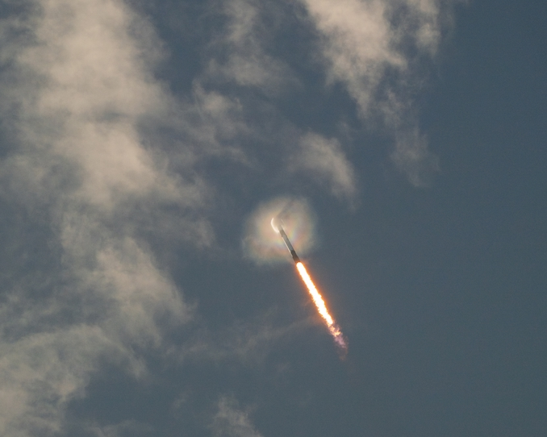

# SpaceX Launches 29 Starlink Satellites on Memorial Day, Falcon 9 Completes 28th Flight

**Summary:** On May 25, 2026 (U.S. Memorial Day), SpaceX successfully launched 29 Starlink V2 Mini Optimized satellites into low Earth orbit aboard a Falcon 9 from Launch Complex 40 at Cape Canaveral Space Force Station. The mission, Starlink 10-47, marked Falcon 9 first stage B1078's 28th flight and the 151st drone ship landing for the vessel "A Shortfall of Gravitas." This was SpaceX's 60th orbital flight of 2026.

## Mission Overview

The Starlink 10-47 mission added 29 Starlink V2 Mini Optimized satellites to SpaceX's megaconstellation, which now consists of more than 10,000 spacecraft in low Earth orbit providing broadband internet service. The satellites were deployed approximately 61 minutes after liftoff.

This launch maintained SpaceX's high-frequency launch cadence, representing the company's 60th orbital flight of 2026. Weather conditions were favorable with an 85% probability forecast from the 45th Weather Squadron, with only minor concerns about cumulus clouds forming over the Atlantic.

## Rocket and Recovery

Falcon 9 first stage B1078 performed its 28th flight, having previously supported missions including:

- NASA Crew-6
- USSF-124
- SES O3b mPOWER-B
- BlueBird 1-5 and Nusantara Lima

Approximately 8.5 minutes after liftoff, B1078 landed on the drone ship "A Shortfall of Gravitas" (ASOG) positioned in the Atlantic Ocean off the coast of South Carolina. This was the 151st landing for this vessel.

## Second Stage and Satellite Deployment

After stage separation, the Falcon 9 second stage shut down approximately 8 minutes and 39 seconds into flight and entered a coast phase, before a brief second burn at T+52 minutes. The stack of 29 Starlink V2 Mini satellites was deployed at approximately 61 minutes after liftoff.

## Memorial Day Launch Background

Conducting a launch on Memorial Day is relatively rare for SpaceX. The company proceeded with the mission after the 45th Weather Squadron forecast an 85% chance of favorable weather during the launch window.

## Sources (original pages)

- [Spaceflight Now: SpaceX launches 29 Starlink satellites on Memorial Day](https://spaceflightnow.com/2026/05/24/live-coverage-spacex-to-launch-29-starlink-satellites-on-a-falcon-9-rocket-from-cape-canaveral/)
