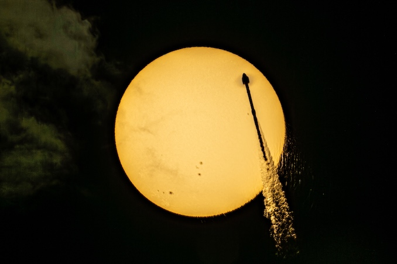

# SpaceX Falcon 9 Launches 24 Starlink Satellites from Vandenberg, Booster Lands on Drone Ship

**Summary:** SpaceX successfully launched 24 Starlink 17-37 satellites aboard a Falcon 9 from Vandenberg Space Force Base on May 26, 2026. Liftoff occurred at 7:50:34 a.m. PDT (10:50:34 a.m. EDT / 1450:34 UTC). Booster B1100 completed its sixth flight, landing on the drone ship 'Of Course I Still Love You' in the Pacific Ocean approximately 8.5 minutes after liftoff — the 198th landing on that vessel and the 615th overall booster recovery for SpaceX.

## Sources (original pages)

- [Spaceflight Now: SpaceX launches 24 Starlink satellites on Falcon 9 rocket from Vandenberg SFB](https://spaceflightnow.com/2026/05/26/live-coverage-spacex-to-launch-24-starlink-satellites-on-falcon-9-rocket-from-vandenberg-sfb-8/)
