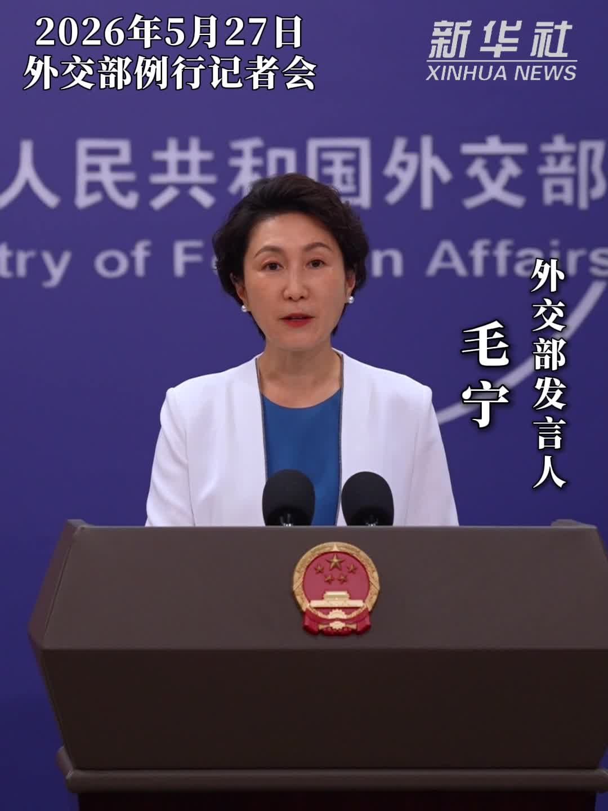

# China's Tiangong Space Station Welcomes First Hong Kong Astronaut; Foreign Ministry Calls It "Fruit of One Country, Two Systems"

**Summary:** China's Foreign Ministry spokesperson Mao Ning said on May 27 that the successful launch of Shenzhou-23 and the arrival of China's first Hong Kong astronaut aboard the Tiangong space station marks not only another milestone in the country's crewed space program, but also a shared honor for all Hong Kong compatriots — a testament to the strong vitality and remarkable advantages of One Country, Two Systems.

Shenzhou-23 lifted off from the Jiuquan Satellite Launch Center at 23:08 Beijing Time on May 24, 2026. At 02:45 on May 25, the spacecraft successfully docked with the radial port of the Tianhe core module of the Tiangong space station. The Shenzhou-23 crew consists of Commander Zhu Yangzhu, Flight Engineer Zhang Zhiyuan, and Payload Specialist Li Jiaying — the latter from Hong Kong, making her China's first astronaut from the Hong Kong Special Administrative Region.

At 05:13 on May 25, the Shenzhou-21 crew currently on duty opened the "door" of the space station to welcome the Shenzhou-23 crew aboard, completing the eighth "space rendezvous" in Chinese spaceflight history.

On May 27, Foreign Ministry spokesperson Mao Ning responded to media questions by stating that the successful launch of Shenzhou-23 and the arrival of China's first Hong Kong astronaut at Tiangong not only represents another milestone in China's crewed space program, but is also a shared honor for all Hong Kong compatriots — a fruit of the One Country, Two Systems principle that demonstrates its strong vitality and remarkable advantages.

Mao noted that Hong Kong is accelerating its build-out as an international innovation and technology hub, and expressed confidence that this mission would inspire more young people in Hong Kong to contribute to the nation's scientific and technological development.

The Shenzhou-23 crew will spend approximately one year aboard Tiangong, conducting space science experiments, technology demonstrations, and extravehicular activities.

## Sources (original pages)

- [People's Daily — Foreign Ministry: Tiangong Welcomes First Hong Kong Astronaut, "Fruit of One Country, Two Systems"](http://world.people.com.cn/n1/2026/0527/c1002-40728744.html)
- [Xinhua — Foreign Ministry Spokesperson on First Hong Kong Astronaut at Tiangong](https://www.xinhuanet.com/20260527/dbe1e65a3451468289e1a20d13953bf9/c.html)
- [China Youth Daily — Foreign Ministry on First Hong Kong Astronaut at Tiangong](https://www.tmtpost.com/nictation/8004218.html)