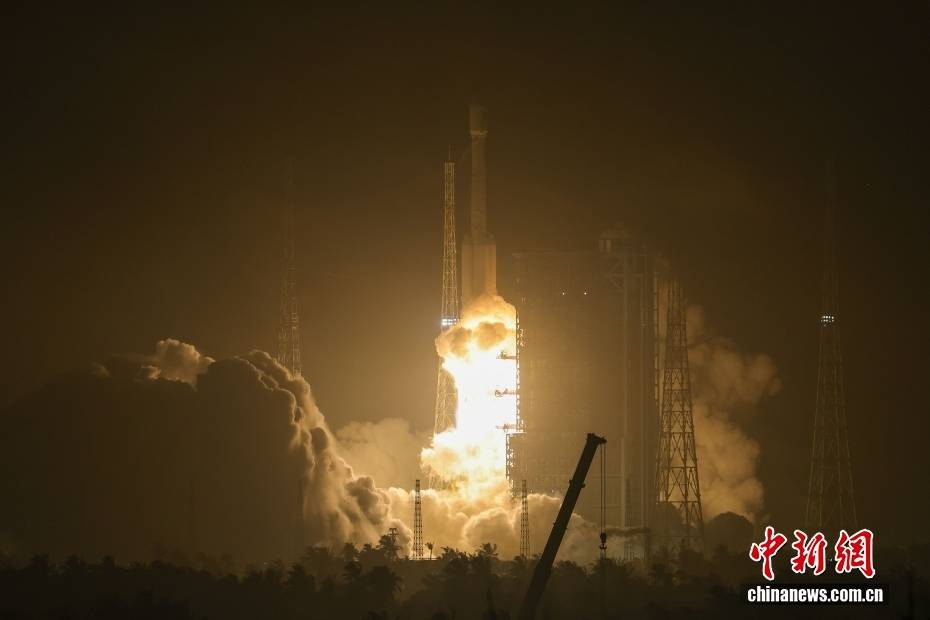
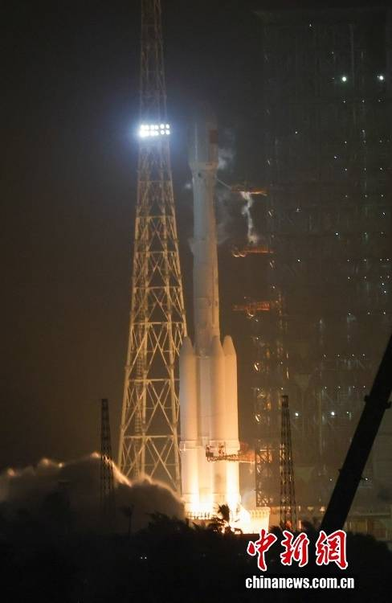
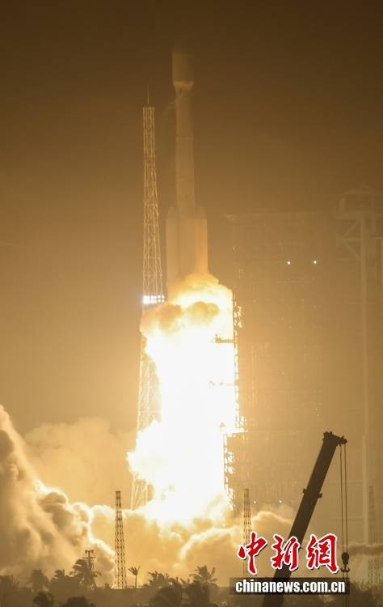

# China Launches Tongxing-24 Communication Technology Test Satellite on Long March 7

**Summary:** China successfully launched the Tongxing-24 (CX-24) communication technology test satellite aboard a Long March 7 modified (CZ-7A) rocket from the Wenchang Spacecraft Launch Site at 00:16 Beijing time on May 27, 2026. The satellite entered its designated orbit and the launch was declared a complete success. The satellite will primarily conduct verification tests for multi-band, high-speed satellite communication technologies. This mission marked the 645th flight of the Long March rocket family.

## Sources (original pages)

- [The Paper — China Successfully Launches Tongxing-24 Communication Satellite](https://www.thepaper.cn/newsDetail_forward_33240918)
- [Reference News — China Successfully Launches Tongxing-24 Communication Satellite](http://www.sohu.com/a/1028103763_123753)

*Long March 7 modified rocket launches from Wenchang | Credit: CNSphoto / Luo Yunfei*

*Long March 7 CZ-7A launches into the night sky | Credit: CNSphoto / Luo Yunfei*

*Spectators at the Wenchang Space Launch Viewing Center | Credit: CNSphoto / Luo Yunfei*
