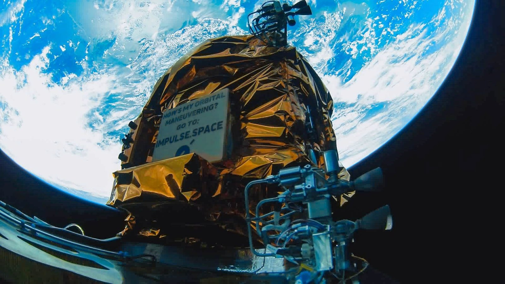

# Impulse Space raises $500 million Series D: SpaceX's first hire Tom Mueller wants to make "trucks in space" routine

**Summary:** On June 2, 2026, California-based in-space mobility company Impulse Space — founded in 2021 by SpaceX's first engineer Tom Mueller — announced a $500 million Series D funding round co-led by 137 Ventures and Banner VC. The new capital will scale production of the Mira orbital transfer vehicle, accelerate the Helios kick stage toward its planned 2027 debut (which is already sold out), and add 200 new employees. The round brings Impulse's cumulative funding to more than $1 billion.

## The "last mile" of space

Over the past decade, the cost of getting payloads to orbit has collapsed thanks to SpaceX, Rocket Lab and other reusable-launch startups. But once a satellite is in space, getting it from its initial drop-off orbit to its final operating orbit — from LEO to GEO, from Earth orbit to cislunar space — still mostly depends on one-shot chemical upper stages, with all the cost and inefficiency that implies.

Impulse Space is targeting exactly that gap. Mueller led the SpaceX teams that developed the Merlin engine and Draco thruster before founding Impulse in 2021. "Rockets are like container ships, which carry cargo most of the way to its destination," he told Space.com. "But those big ships can't do all the work; after they dock, trains, trucks and vans are still needed to get the goods the rest of the way. That's where we come in — we're building the trucks, vans and trailers of space."

## Current product: Mira

Mira is Impulse's in-production orbital transfer vehicle, capable of carrying up to 300 kilograms (660 pounds) of payload. It has flown three times to date, all on SpaceX Falcon 9 rideshare missions (named LEO Express 1, 2 and 3, launched in November 2023, January 2025 and November 2025). The three flights have all stayed in low Earth orbit, but Mira is maneuverable enough to deliver customer payloads to geostationary orbit, cislunar space or beyond, according to the company.

## In development: Helios

Helios is Impulse's kick stage, a "rocket on top of a rocket" built around the company's Deneb engine. The kick stage is designed to be compatible with a wide range of launch vehicles: SpaceX Falcon 9, Falcon Heavy and Starship; Blue Origin New Glenn; and ULA Vulcan.

- **8,800 lb (4,000 kg) to GEO** in a single drop, enough for medium-class communications, weather or spy satellites;
- **5× more payload for Mars missions** than current best-practice, and significant reductions in transit time to the outer planets, according to Mueller;
- **First flight in 2027**, with the slot already fully booked with customer payloads;
- **Lunar lander** to follow shortly after, using Helios to deliver Impulse's in-house robotic lander to the lunar surface — possibly as early as 2028.

## Funding and headcount

The $500 million Series D is co-led by 137 Ventures and Banner VC, bringing Impulse's cumulative funding past $1 billion. Use of proceeds:

- **Scale Mira production** to meet government and commercial demand for orbital mobility;
- **Accelerate Helios** through design, engine testing and ground campaigns to its 2027 debut;
- **200 new hires** spanning propulsion, manufacturing, spacecraft integration and ground operations;
- **Lunar lander development** in parallel with the Helios manifest.

"As activity in orbit increases, in-space mobility becomes foundational," said Adam Ramada, managing partner at Banner VC. "Impulse is building the infrastructure that enables the next layer of growth for the space economy."

## National security and on-orbit asset protection

Mueller framed the technology in explicitly national-security terms. "We see our adversaries up there maneuvering around our assets, and we need to protect our assets," he told Space.com. "I think that's the impetus right now, is to get some protection, to know more about what's going on up there."

Mira and Helios can perform satellite-servicing missions, in-orbit reconnaissance and anomaly tracking, all capabilities the U.S. Department of Defense and intelligence community have flagged as priorities as Earth orbit grows more contested.

## Where the "last mile of space" race stands

Impulse is not the only player in in-space mobility — Momentus, Atomos Space, Orbit Fab and others are pursuing variants of the same vision. But Mueller's two decades of propulsion experience at SpaceX, combined with the company's vertically integrated engine and vehicle manufacturing, has been the differentiator that brought the company past $1 billion in cumulative funding. The new round gives Impulse the capital to compete head-on across both the commercial constellation mobility market and the national security in-orbit services market.

## Sources (original pages)

- [Unlocking 'the true space age': Impulse Space raises $500 million to build out fleet of ultra-mobile spacecraft — Space.com](https://www.space.com/space-exploration/launches-spacecraft/impulse-spacex-500-million-investment-space-ultra-mobile-spacecraft) (by Mike Wall, June 2, 2026)
- [Impulse Space — official news and product pages](https://www.impulsespace.com/) (company press release and Mira / Helios product documentation)
