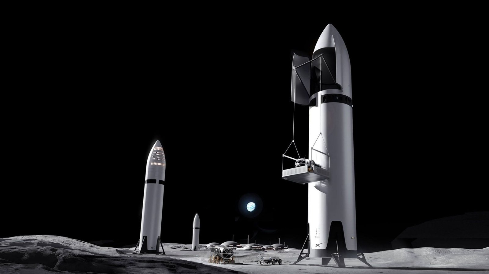

# SpaceX files S-1 prospectus, will list as SPCX at up to 2 trillion dollar valuation

**Summary:** On June 2, 2026, SpaceX formally filed an S-1 registration statement with the U.S. Securities and Exchange Commission, planning to trade on public markets under the ticker symbol **SPCX**. According to experts cited by Space.com, the offering could value the company at roughly **1.75 to 2 trillion U.S. dollars**, making it a strong candidate for the largest initial public offering in history. The S-1 also positions SpaceX as "a conglomerate with exposure to AI, advertising, communications and space manufacturing and operations," explicitly stepping beyond its identity as a rocket company.

## Key facts

- **Ticker:** SPCX
- **Valuation range:** approximately 1.75–2 trillion U.S. dollars (lower bound from Scott Sacknoff of the SPADE Defense Index; upper bound from Space.com's synthesis)
- **Filing type:** SEC Form S-1, the standard U.S. registration document for domestic IPOs, disclosing material corporate and financial information
- **Self-description in the S-1:** "a conglomerate with exposure to AI, advertising, communications and space manufacturing and operations"

## Expert reactions

Space.com canvassed a number of finance and policy specialists. The strongest voices:

**Shaun Davies, associate professor of finance at the Leeds School of Business, University of Colorado Boulder:**

> "This could be one of the largest IPOs in history, both from a valuation perspective and from the sheer amount of attention it will attract. Everyone will be watching because of the Elon factor — love him or hate him, you know who he is."

Davies stressed that SpaceX is no longer just a rocket company: the Starlink broadband megaconstellation and the xAI division, both under the SpaceX umbrella, are tightly coupled to the broader AI arms race now playing out.

**Scott Pace, director of the Space Policy Institute and professor of the practice of international affairs at George Washington University's Elliott School:**

> "First of all, congratulations should go to Elon Musk and the team at SpaceX that made the IPO possible. Secondly, I believe fundamental drivers of growth will be information technologies that integrate communications, data and artificial intelligence using space in new ways."

> "The iconic rocket launches and landings that the public sees have just opened the door to new opportunities."

**Scott Sacknoff, manager of the SPADE Defense Index:**

> "No commercial space firm has had a greater impact on private investor interest than SpaceX. Its forthcoming IPO has seen mainstream investor enthusiasm ramp up to a level of almost irrational exuberance."

> "At a 1.75 trillion dollar valuation, investors that make money will likely be traders, not buy-and-hold investors."

Sacknoff also noted that capital is likely to migrate from other firms as investors rotate into SpaceX. "Publicly traded space companies have seen stock prices rise 60–100% this year," he said, and a rumored merger with Tesla would only push SpaceX further into automobiles, power storage, and adjacent sectors.

**Ann L. Lipton, professor of law at Tulane University (corporate governance and securities law):**

> "The hype surrounding the IPO does seem to have piqued investor interest in space stocks more generally. But it's true that the financials being disclosed suggest that SpaceX's profitability is being used to finance artificial intelligence development."

## Strategic implications

The S-1 itself issues a forward-looking caveat:

> "We face a number of challenges relating to our business and growth strategy and, ultimately, the achievement of our mission to make life multiplanetary, understand the true nature of the universe, and extend the light of consciousness to the stars."

Sacknoff framed the change bluntly: SpaceX "is a conglomerate with exposure to AI, advertising, communications and space manufacturing and operations," not a launch company. Davies called the deal "aerospace, communications infrastructure, defense technology and AI all wrapped into one company" — the kind of bellwether event that could open the floodgates for other IPOs waiting on the sidelines, or, if it stumbles, could "effectively shut down the IPO market for a while, particularly for speculative growth companies that have been waiting on the sidelines."

The S-1 filing is the single largest capital-markets event in the commercial space sector of 2026, and the culmination of years of speculation about when — and at what multiple — SpaceX would go public.

## Sources (original pages)

- [Will SpaceX still be a launch company after its historic IPO? — Space.com](https://www.space.com/space-exploration/satellites/will-spacex-still-be-a-launch-company-after-its-historic-ipo)
