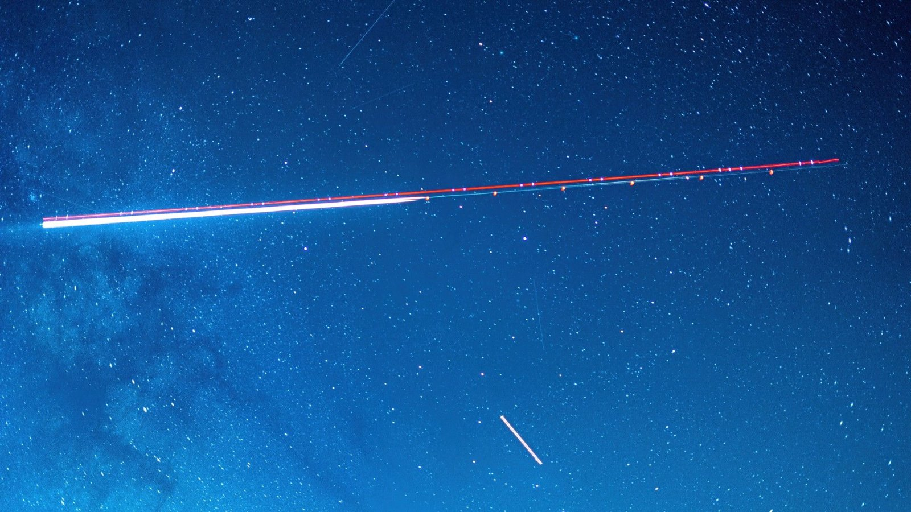

# SpaceX Wins $4.16 Billion Space Force Contract to Build a Space-Based Air-Tracking Constellation

**Summary:** On May 29, the U.S. Space Force announced a $4.16 billion contract award to SpaceX under the Space-Based Airborne Moving Target Indicator (SB-AMTI) program, a satellite constellation designed to "track and target airborne threats globally." SpaceX is the first of nine companies named to the SB-AMTI vendor pool; the remaining eight have not yet been publicly disclosed. The award reflects the service's push to move part of its airborne-target tracking workload from manned aircraft to orbit, in response to adversaries' anti-access/area-denial (A2/AD) defenses.

The Space Force framed the contract around a specific operational gap: in contested or denied airspace, the manned platforms that traditionally perform airborne target tracking become too exposed. SB-AMTI's premise is that a satellite layer can deliver "continuous oversight where traditional sensors cannot reach," in the words of USSF Col. Frazier, protecting the freedom of maneuver of joint forces.

In the May 29 announcement, the Space Force described the SB-AMTI architecture as a "complex system-of-systems" that integrates space-based sensors, fast and secure communications, and ground data processing. The service is explicit that the new constellation will complement rather than replace its existing airborne tracking fleet: "Right now, the two methods are meant to compliment each other."

The Space Force also tied SB-AMTI to the Trump administration's marquee "Golden Dome" missile defense initiative, with industry analysts noting that the constellation is expected to feed targeting data into the broader missile-tracking architecture. More vendor awards are anticipated over the coming year, the service said, as it works to widen the industrial base behind the program.

## Sources (original pages)

- [SpaceX wins $4 billion Space Force contract for satellites that target 'airborne threats' anywhere on Earth — Space.com](https://www.space.com/space-exploration/satellites/spacex-wins-usd4-billion-space-force-contract-for-satellites-that-target-airborne-threats-anywhere-on-earth) (by Julian Dossett, June 2, 2026)
