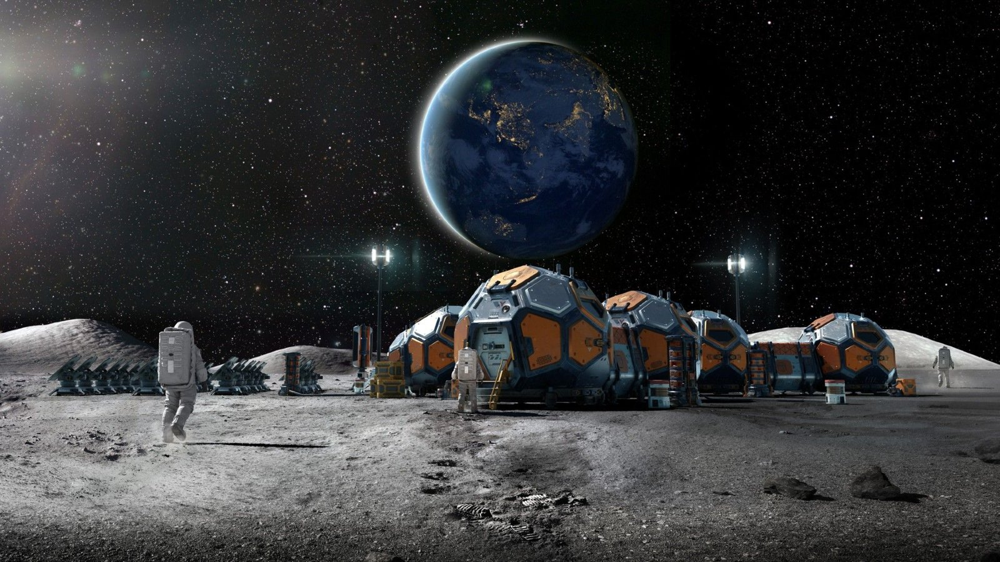

# Mars samples should be quarantined on the moon first, scientists argue in new policy paper

**Summary:** A paper published online first in Springer Ambio on May 28, 2026, and reported by Space.com on June 3, makes a deliberately provocative case: before any sample from Mars, an asteroid, or an icy moon is allowed to return to Earth, it should pass through a dedicated extraterrestrial biocontainment facility on the lunar surface, handled only by robotic systems, and certified non-hazardous before being allowed inside Earth's biosphere. The authors — Frederick I. Moxley, director of Strategic Threat Analysis and Research (STAR) Laboratories in Star, Idaho, and Anthony Ricciardi, a McGill University invasion biologist — point out that neither NASA's Artemis lunar base plan nor the China-Russia led International Lunar Research Station (ILRS) has published explicit planetary protection procedures, and they want lunar biocontainment capability written into the next baseline of lunar base design.

## A paper that landed in late May

The paper, "Protecting earth from extraterrestrial contamination: The case for a lunar biocontainment facility," was published online first in the Springer journal Ambio on May 28, 2026, with DOI `10.1007/s13280-026-02428-5`. Moxley is first and corresponding author, with STAR Laboratories, a technical consultancy in Star, Idaho. Ricciardi, the co-author, is a long-standing authority on biological invasions and has served on the editorial boards of journals including Biological Invasions.

The paper's abstract, as cited by Space.com, frames the stakes plainly: "The advancement of space exploration into an era of sample return missions from Mars, asteroids, and icy moons raises the potential for biological contamination of Earth." The authors argue that the agencies currently planning return missions have not built up rigorous containment capability against an unknown extraterrestrial organism, and that the moon is uniquely suited to fill that gap.

## What the proposal actually calls for

The lunar biocontainment facility the authors describe has three non-negotiable features:

- **Fully robotic handling.** Every sample entering the facility is opened, ground, sampled, and sealed without human contact, minimizing both crew exposure and the risk of accidental release.
- **Permanent "natural quarantine" from Earth.** The moon is 380,000 km away, with no atmosphere, no biosphere, and no liquid water. The authors treat this as a built-in isolation barrier that no ground-based lab can match.
- **A mandatory lunar P4-equivalent gatekeeping step.** Returned samples must pass live-detection, inactivation, and secure-seal steps on the moon, with a "safe-to-enter" certificate issued by an independent body before any capsule is allowed to leave lunar vicinity for Earth.

In his comments to Space.com, Moxley framed the facility as "a firewall between Earth and any potentially hazardous live organisms" that might ride back with future sample return missions.

## A real case, not just a thought experiment

The paper does not leave the risk at the theoretical level. It cites a documented case from the International Space Station (ISS): strains of the bacterium Enterobacter bugandensis isolated from the ISS have undergone genetic and functional changes distinct from their terrestrial counterparts during long-term exposure to the space environment. The pattern closely mirrors the kind of "novel function, novel invasion risk" trajectory that Ricciardi has spent his career studying on Earth.

Ricciardi coined a new term for the Space.com interview: "rebound contamination." The scenario he describes: a microbe introduced to Mars (or another body) mutates and evolves new functional traits; once it is brought back to Earth, it is effectively a novel organism. The paper labels this "sequential forward and back contamination."

## The real gap: Artemis and ILRS have no published answer

The most policy-relevant section of the paper is its survey of what the two major lunar base programs have actually said about planetary protection. Moxley told Space.com: "It's no secret that there is a race between the United States and China to build a base on the moon. However, whoever gets there first will likely determine where it will be located and how it will be operated, among other things. Elements as to architectural components for each are still a work in progress."

He singled out the China-Russia led International Lunar Research Station (ILRS), which has signed a memorandum of intent to deploy a nuclear reactor on the lunar surface by 2035 to support construction, but where "very little is known as to their architectural details." He delivered the same critique to NASA's Artemis lunar base: neither program, in his reading of public materials, has explained how it will handle planetary protection.

"Unfortunately, none of their efforts have described how they will deal with planetary protection measures," Moxley said.

## Why the timing matters: a 2030s sample return wave

The paper lands at a notable moment for Mars Sample Return (MSR). The joint NASA-ESA MSR architecture is moving from planning into execution, with the goal of bringing the rock cores cached by Perseverance in Jezero Crater back to Earth before the end of the decade. Once those samples are inside Earth's gravity well, any lapse in containment is amplified in exactly the kind of "natural isolation barrier failure" the paper warns about.

The paper also covers samples from icy moons — Europa, Enceladus, and Titan — long considered among the most plausible sites for life in the solar system, and samples from asteroids, where the active Hayabusa2 and OSIRIS-REx lineages are already returning material. The authors recommend that all three classes of samples flow through the same lunar gatekeeping step rather than being handled on a per-mission basis.

## What happens next

As of the Space.com report's publication on June 3, no agency — NASA, ESA, the China National Space Administration (CNSA), or Roscosmos — had issued a public response to the proposal. Moxley and Ricciardi say the next step is to push the concept into international discussions of lunar base design.

"This is a facility that should be incorporated into lunar base planning from the beginning, rather than assembled hastily when extraterrestrial samples arrive at Earth's doorstep," Ricciardi told Space.com. "Decades of research on invasive species have demonstrated how an organism introduced to the wrong place at the wrong time can spread uncontrollably, with potentially devastating and irreversible long-term impacts on ecosystems. This research justifies a strong precautionary approach against introductions of extraterrestrial origin."

Leonard David closed his Space.com piece with the line that has now become the paper's tag: the moon, Moxley and Ricciardi argue, "may become humanity's first line of biological defense."

## Sources (original pages)

- [Space.com — Should we store Mars samples on the moon to keep alien germs away from Earth?](https://www.space.com/astronomy/moon/should-we-store-mars-samples-on-the-moon-to-keep-alien-germs-away-from-earth) (Leonard David, June 3, 2026)
- [Springer Ambio — Protecting earth from extraterrestrial contamination: The case for a lunar biocontainment facility](https://link.springer.com/article/10.1007/s13280-026-02428-5) (Moxley & Ricciardi, Online First May 28, 2026; DOI: 10.1007/s13280-026-02428-5)
