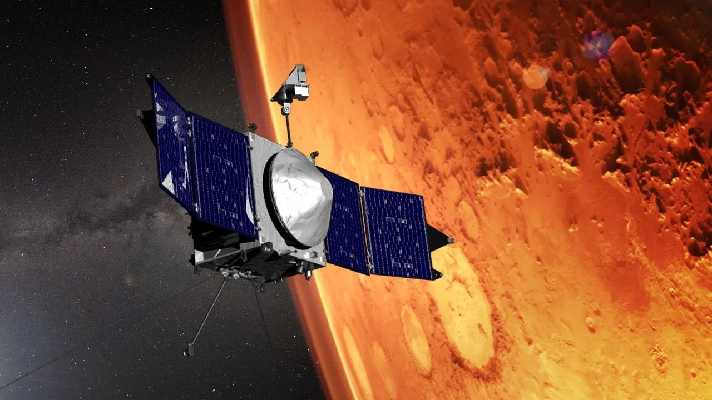

# NASA Officially Ends MAVEN Mars Mission; Only Two Probes Remain in Mars Orbit

**Summary:** After months of attempts to reestablish contact, NASA officially declared the MAVEN (Mars Atmosphere and Volatile EvolutioN) mission over on June 3. The spacecraft's last transmission was received by the Deep Space Network on December 6, 2025, just before MAVEN passed behind Mars; when it emerged on the other side, telemetry showed the probe had switched to safe mode, and all subsequent recovery efforts failed. Designed for a one-year primary mission, MAVEN operated for 12 years. Its departure leaves NASA with just two operational Mars orbiters — the 2001-launched Mars Odyssey and the 2005-launched Mars Reconnaissance Orbiter (MRO) — both also operating well past their design lifetimes.

MAVEN launched aboard a United Launch Alliance Atlas V in November 2013 and entered Mars orbit 10 months later. It was the first probe purpose-built to study how Mars' atmosphere escapes into space and how that process interacts with the solar wind. Across more than a decade of operations, the spacecraft's data underpinned major findings about the planet's transition from a wet, possibly habitable world to the cold desert seen today. Even after the spacecraft fell silent, researchers continued to extract new science from its archived data.

"The data collected from MAVEN will continue to provide valuable insight into Mars for decades to come," said Louise Prockter, director of NASA's Planetary Science Division, in the agency's announcement. Prockter is scheduled to appear at a press briefing at 2 p.m. EDT (1800 GMT) on June 3 to discuss the end of mission and answer questions about follow-on science planning.

With MAVEN gone, NASA's Mars relay network is now down to two aging orbiters. Mars Odyssey (launched 2001, 25 years in service) and MRO (launched 2005, 21 years in service) both continue to function beyond their design lifetimes, but neither has a direct replacement ready for launch. MRO in particular carries the critical relay role that will be needed by future Mars Sample Return architecture, and its eventual failure would create a capability gap that no current NASA mission is positioned to fill. ESA's Mars Express and ExoMars Trace Gas Orbiter are expected to take on additional international relay responsibilities in the interim.

## Sources (original pages)

- [NASA's MAVEN Mars orbiter is officially dead after months of radio silence](https://www.space.com/space-exploration/launches-spacecraft/nasas-maven-mars-orbiter-is-officially-dead-after-months-of-radio-silence)
