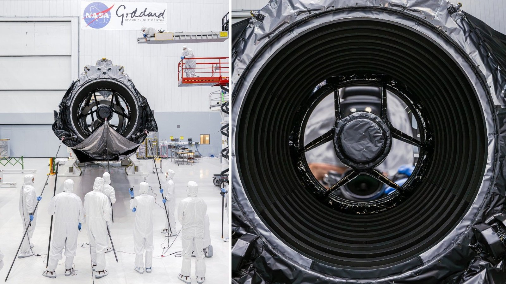

# Roman Space Telescope's primary mirror passes its final inspection, clearing the way for an Aug. 30 launch

**Summary:** Six weeks after declaring Roman "assembly complete," NASA on June 3 released the results of a milestone the team had reached on May 20: the final inspection of the observatory's 2.4-meter primary mirror. Using a newly developed method that pairs a high-resolution camera with a long-focal-length lens, engineers at Goddard Space Flight Center found no foreign-object debris and no measurable shifts on the mirror, and confirmed that the earlier "shake test" left no observable imprint on the optical surface. Roman project manager J. Scott Smith framed it as the last time the engineering team will lay eyes on the telescope before it ships to Kennedy Space Center and is encapsulated in a SpaceX Falcon Heavy fairing. The mission is now tracking a launch window that opens as early as Aug. 30.

## Why the final inspection is more than a formality

Roman was declared "complete" in April after the 2.4-meter primary was integrated with the rest of the Optical Telescope Assembly, but the engineering team held the door open for one more round of close-up scrutiny — both to confirm that the structural "shake test" had not left any particle, fiber, or condensate on the mirror, and to verify that the high-resolution images taken on May 20 matched the historical baseline.

The procedure ran in two stages. First, engineers rotated the telescope onto its side and deployed the deployable aperture cover that will shield the mirror in orbit, exposing the primary in the same configuration it will assume on station. Second, they ran a long-focal-length industrial camera down the barrel of the telescope, image-stitching the entire 2.4-meter surface. Both stages came back clean. "We developed a method of using a high-resolution camera equipped with a very powerful zoom lens to do a multi-purpose inspection," Eegholm said. "The mirror passed with flying colors, keeping the mission on track for an early September launch."

## Sub-wavelength precision is the point

Roman's case for being a flagship rests on its field of view: unlike Hubble, Roman will image a wide swath of the near-infrared sky in a single pointing, and its sensitivity to faint objects pushes every optical surface to sub-wavelength tolerances. "In order to gather very sensitive measurements of objects strewn throughout space, all of Roman's components have to be ultraprecise," Eegholm said in the same statement. "The primary mirror certainly delivers on that promise."

For a primary the same diameter as Hubble's, any 100-micron particle or any few-micron deformation introduced on the ground becomes a permanent scatter source once the telescope is on station. That is why Roman went back to a visual-plus-imaging double check at the end of May rather than trusting the historical baseline alone.

## "The last time we lay eyes on it"

Smith put the milestone in a register that is rare for a NASA engineering note. "The Roman engineering team laid eyes on the telescope for the final time before it, in turn, becomes the eyes of humanity, revealing the wonders of the cosmos," he said. "It is a bittersweet moment, with the dedication and craftsmanship of the team encapsulated in the telescope itself."

The remark gestures at Roman's timeline: more than two decades from formulation to delivery, with a cancellation threat, a budget reset, a re-scoped field of view, and a stack of independent reviews along the way. With the 2.4-meter primary now accepted on its final pre-shipment inspection, Goddard's ground engineering contribution is effectively closed.

## What happens between now and fairing encapsulation

After the May 20 milestone, Roman is moving into shipment and launch-site processing. The mission is currently tracking a launch window that opens as early as Aug. 30 from Kennedy Space Center, on a SpaceX Falcon Heavy. Once on station, the observatory will operate from a Sun-Earth L2 halo orbit for a primary mission of at least five years.

Roman's instrument suite — the Wide Field Instrument (WFI) and the Coronagraph Instrument — has already completed its own independent calibrations, and the May shake test was aimed specifically at the loads expected during ascent. In the June 3 briefing, neither Eegholm nor Smith named a more specific liftoff time than the Aug. 30 opening of the window; under NASA's current public cadence, a firmer date typically lands four to six weeks before encapsulation.

## How it fits the May 2 milestone

On May 2, NASA had already announced that Roman's assembly and testing work was "complete" and locked in a September window. The June 3 update covers the remaining 5% of work the team reserved for the very end — one more visual confirmation of the primary, run in the days before the observatory leaves the cleanroom for good.

For the project, the May 20 inspection is not "we found something new," it is "we confirmed there is nothing." For the science community, it is a long-awaited green light: whether Roman makes the 2026 wide-field survey cycle now depends on the cadence of fairing encapsulation, vehicle integration, and pad processing between now and the late-August opening of the window.

## Sources (original pages)

- ['The mirror passed with flying colors': NASA just took its last look at the Nancy Grace Roman Space Telescope before launch — Space.com](https://www.space.com/astronomy/the-mirror-passed-with-flying-colors-nasa-just-took-its-last-look-at-the-nancy-grace-roman-space-telescope-before-launch)
- [NASA's Roman Space Telescope Primary Mirror Gets Last Look — NASA official release](https://www.nasa.gov/missions/roman-space-telescope/nasas-roman-space-telescope-primary-mirror-gets-last-look/)
