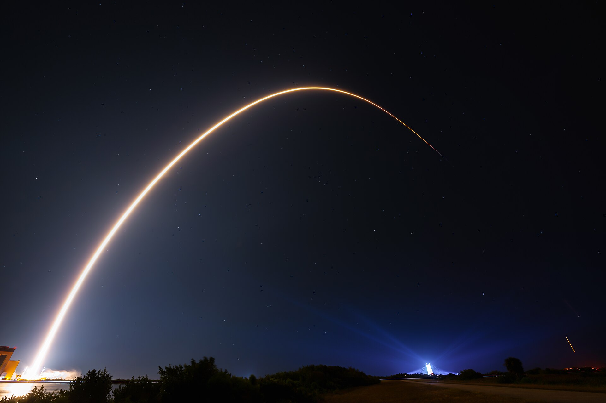

# Starlink 10-43 scrubbed for weather: SpaceX Cape launch slips to June 4 window

**Summary:** SpaceX scrubbed the Starlink 10-43 mission at 7:24 a.m. EDT (11:24 UTC) on June 3, 2026, after a south-moving cool front pushed scattered marine showers and thick mid-level cloud decks into the Cape Canaveral launch window. The 45th Weather Squadron had assessed only a 30% chance of acceptable weather, flagging the cumulus cloud, thick cloud layer, and (under heavier showers) the surface electric fields rules. The next attempt opens at 4:00 a.m. EDT (08:00 UTC) on Thursday, June 4, with booster B1090 flying for the 12th time and targeting the drone ship A Shortfall of Gravitas — a successful touchdown would mark the vessel's 153rd landing and SpaceX's 619th booster recovery to date.

## The call to scrub

Spaceflight Now's live-coverage page posted the scrub at 7:24 a.m. EDT (11:24 UTC):

> "SpaceX scrubbed the launch."

The 45th Weather Squadron's forecast walked through the failing rules one by one. A marine shower band was expected to scrape the east-central Florida coastline during the window; mid-level cloud cover was trending pessimistic in the latest high-resolution guidance, raising concern under both the cumulus cloud rule and the thick cloud layer rule. The surface electric fields rule sat as a distant third, contingent on any shower activity intensifying further. SpaceX had also pushed the T-0 time in an earlier update at 10:05 a.m. EDT (14:05 UTC), but the closing call was a full scrub rather than a further slip.

## Mission and hardware

- **Payload:** 29 Starlink V2 Mini Optimized satellites
- **Booster:** B1090, 12th flight (previously flew NASA's Crew-10, CRS-33, Bandwagon-3, and others)
- **Recovery target:** drone ship A Shortfall of Gravitas, positioned in the Atlantic off the coast of South Carolina
- **Original window:** 2026-06-03, 06:00–09:43 EDT (10:00–13:43 UTC)
- **Next window:** 2026-06-04, opening 04:00 EDT (08:00 UTC)

## Sources (original pages)

- [Spaceflight Now: Poor weather forces launch scrub of SpaceX's Falcon 9 rocket from Cape Canaveral](https://spaceflightnow.com/2026/06/03/live-coverage-spacex-to-launch-29-starlink-satellites-on-falcon-9-rocket-from-cape-canaveral-15/)
- [SpaceX: Starlink mission list (official updates)](https://www.spacex.com/launches/)
