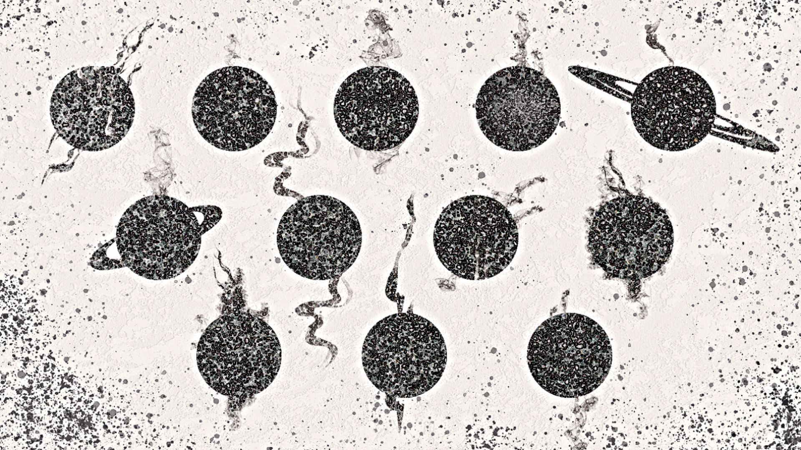

# Mini-Neptune exoplanets may run on a natural diesel engine, JWST data suggests

**Summary:** Reporting published on space.com on June 4, 2026, spotlights a new study that reframes a long-standing mystery in exoplanet chemistry. The James Webb Space Telescope (JWST) keeps returning near-featureless spectra whenever it looks at the atmosphere of a mini-Neptune — a class of planet that is the most common type found so far in the galaxy. University of Chicago chemical engineer Jeehyun Yang, who did his Ph.D. on combustion-engine exhaust, noticed that the smooth absorption curve from those atmospheres is essentially the same shape as the soot signal from a diesel engine. His team proposes that polycyclic aromatic hydrocarbons (PAHs) — honeycomb-shaped carbon particles produced when carbon, hydrogen and oxygen react at high temperature and pressure — are the missing ingredient. "It's like you have a natural diesel engine in the deep atmosphere of a planet," Yang said in a statement.

## A chemical engineer walks into an exoplanet archive

Yang's background is unusual in exoplanet science. His Ph.D. research, completed before he transitioned to atmospheric chemistry, focused on the exhaust chemistry of internal combustion engines. He knew the structure of soot intimately: PAHs form readily when fuels burn hot and under pressure, and the resulting particles absorb light in a characteristic, almost sloped way that flattens out the spectral fingerprints of any gas-phase molecules in the same air column.

When JWST began returning spectra of mini-Neptune atmospheres — the most abundant class of known exoplanet, intermediate in size between Earth and Neptune, and typically on close-in orbits — the data looked, to most observers, like a frustrating wall. Three competing hypotheses were already on the table: water-dominated atmospheres, methane-dominated atmospheres, and a photochemical haze whose exact composition was unknown. Each camp had evidence; none had closed the case. Yang's contribution was to recognize that the slope of the haze spectrum, where the gas signatures should have been, matched the soot absorption curve he had spent years studying in a different context.

## Why PAH chemistry fits the JWST data

PAHs form in environments that combine carbon- and hydrogen-rich gas with temperatures above roughly 1000 K and high pressure. Mini-Neptunes that are tidally locked to their stars can in principle develop exactly such conditions in their deep, sun-facing atmospheres: hot, compressed, and rich in the same elements that make soot possible in a diesel cylinder. Once formed, PAH particles can be lifted by convection into the higher, cooler layers that JWST actually sees. The particles then absorb and scatter starlight across a broad swath of wavelengths, smoothing out the discrete absorption lines of water, methane and carbon dioxide — the three gases that astronomers have spent the last decade hunting for in these atmospheres.

The same chemistry, Yang argues, may also speak to a deeper question in planet formation: where did mini-Neptunes come from? Standard planet-formation theory says the chemistry of the protoplanetary disk varies with distance from the star — heavy metals and silicates condense close in, while water ice, carbon dioxide ice and other volatiles condense farther out. If a mini-Neptune's atmosphere preserves a chemical fingerprint of its birth region, then detecting PAHs in the haze would be consistent with a formation history beyond the snow line, followed by inward migration. The soot signature, in other words, may be a tracer of migration.

## Open questions

The team is careful not to claim the case is closed. PAH formation at the relevant temperatures and pressures is plausible, but turning that plausibility into a quantitative match for the JWST spectra will require:

- Broader wavelength coverage from JWST, especially in the mid-infrared, to pick out individual PAH vibrational bands.
- Laboratory and numerical work that reproduces the temperature, pressure and mixing conditions in a mini-Neptune's deep atmosphere.
- A cross-check against existing photochemical haze models, to confirm that PAHs are dominant rather than one contributor among many.

Until then, the diesel-engine analogy is a strong hint, not yet a finished explanation.

## Sources (original pages)

- [Space.com: Most exoplanets might be "soot factories," scientists say: "Like you have a natural diesel engine"](https://www.space.com/astronomy/exoplanets/most-exoplanets-might-be-soot-factories-scientists-say-like-you-have-a-natural-diesel-engine)
- [NASA / JWST mission page: James Webb Space Telescope](https://science.nasa.gov/mission/webb/)
