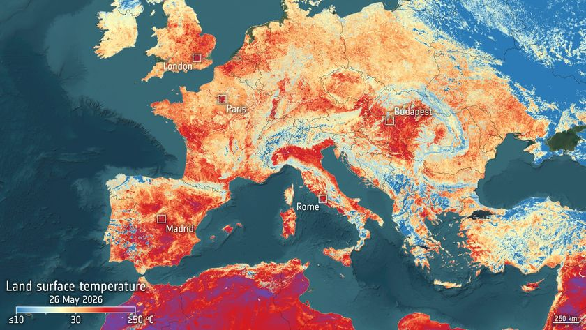

# Sahara meteorite NWA 12774 reveals evidence of a lost solar system world

**Summary:** A study led by geoscientist Aaron Bell of the University of Colorado Boulder reports that NWA 12774, a meteorite recovered from the Sahara in 2019, contains clinopyroxene crystals exceptionally rich in aluminum — a chemical fingerprint of crystallization under far higher pressure than previously assumed for angrite parent bodies. The team argues the parent body may have approached lunar mass and followed a planetary formation pathway distinct from Earth and Mars. NWA 12774 belongs to the angrite class, of which only 68 specimens are known out of more than 80,000 recovered meteorites.

## A rare sample's geochemistry

Angrites are among the oldest volcanic rocks in the solar system, forming contemporaneously with the young Sun — slightly more than 4.55 billion years ago. Using radiogenic isotopes as natural clocks, the team confirmed that NWA 12774 retains the chemical signature of its parent body's original magma crystallization. The paper reports that this meteorite is exceptionally depleted in silica (SiO₂) — the dominant crust-building component of Earth, Mars, and most other known rocky bodies — making it one of the lowest-silica meteorites ever studied.

> "The materials that formed the angrite parent body are fundamentally different from the ingredients of Earth and Mars. These meteorites preserved evidence of a completely different pathway through which early planets developed."

— Aaron Bell, lead author, CU Boulder Department of Geological Sciences

## A pressure fingerprint pointing to a larger parent body

The paper's central evidence comes from crystal-scale chemistry. The clinopyroxene grains identified in NWA 12774 contain unusually high aluminum — a petrological signature of formation at significantly higher confining pressure than earlier estimates assumed for angrite parent bodies (which had been modeled as asteroid-sized). The paper interprets this as evidence that the angrite parent body was massive enough to sustain internal pressures high enough to incorporate aluminum into the early-crystallizing pyroxene structure.

If this inference holds, the angrite parent body would not have been a small asteroid at all, but rather a protoplanet embryo that had already differentiated a crust and mantle — sharply at odds with prevailing angrite-origin models and implying that early solar system architecture included a population of intermediate-scale protoplanetary bodies not captured by the standard formation picture.

## Why "lost"

The paper's authors do not claim this protoplanet survives today. The early solar system experienced repeated collisions and accretionary reshuffling, and the angrite parent body was most likely disrupted not long after its formation, with only a small fraction of its fragments eventually reaching Earth — the 68 angrite specimens known today. The phrase "a distinct and separate evolutionary path" refers to the formation pathway itself, not to the physical survival of the body. NWA 12774 is described as "first definitive evidence" because earlier size estimates for the angrite parent body were anchored to asteroid-scale assumptions, while the pressure data from aluminum-rich pyroxene push the lower bound significantly upward.

## Research team and methods

The study was led by Aaron Bell of CU Boulder, with co-authors including Daniel Dunlap and John Kashuba. The meteorite was recovered from the North African desert in 2019; laboratory work included electron microprobe mineral chemistry, aluminum partitioning simulations in pyroxene, and isotopic comparison with previously cataloged angrites. The study appeared in a peer-reviewed journal on 4 June 2026 (see original link for journal and DOI).

## Scientific significance

Planetary formation models routinely use meteorite composition to infer parent-body properties. NWA 12774's aluminum-rich pyroxene offers a new geobarometer: aluminum content in clinopyroxene correlates quantitatively with formation pressure, letting researchers estimate crystallization conditions directly. If this method can be applied across the existing angrite collection, it offers a way to systematically reconstruct the population of early solar system "existed once, destroyed later" protoplanets that traditional models miss.

## Sources (original pages)

- [Space.com: Meteorite found in Sahara desert may be 1st evidence of lost solar system world](https://www.space.com/astronomy/solar-system/meteorite-found-in-sahara-desert-may-be-1st-evidence-of-lost-solar-system-world)
- [CU Boulder Department of Geological Sciences](https://www.colorado.edu/geologicalsciences/)
