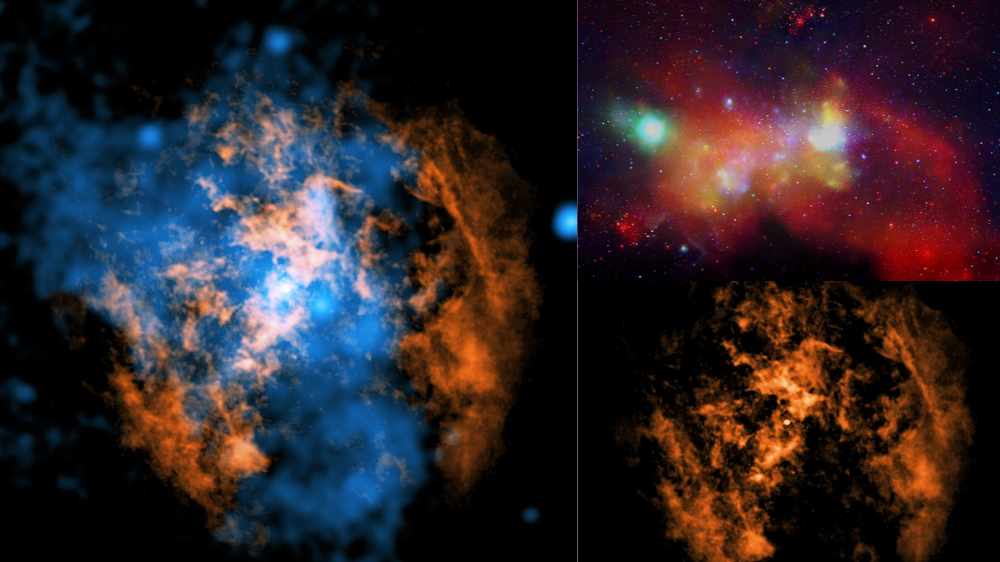

**Summary:** Researchers led by Northwestern University have used the Atacama Large Millimeter/submillimeter Array (ALMA) and NASA's Chandra X-ray Observatory to capture the first direct evidence of plasma winds blowing outward from Sagittarius A* (Sgr A*), the supermassive black hole at the center of the Milky Way. Published in The Astrophysical Journal Letters, the result closes a roughly 50-year-old gap between theory and observation.

As black holes consume surrounding matter, theory predicts that they should drive plasma away from their immediate vicinity — a process dubbed "black hole winds." The concept was first proposed in the 1970s and is thought to apply to virtually every accreting black hole. Yet for Sgr A*, a roughly 4-million-solar-mass behemoth sitting 26,000 light-years from Earth, no such wind had ever been unambiguously detected. The mystery persisted for half a century.

"There is the thing that everybody's been looking for for 50 years," said study lead Mark Gorski, an assistant professor of astronomy in Northwestern's Weinberg College of Arts and Sciences, in a university release.

Sgr A* operates on a sparse diet of gas and dust, with an accretion rate far lower than that of many other supermassive black holes. Winds were expected under such "low-luminosity" conditions, but the signal was too faint, and the surrounding environment too complex, for previous instruments to resolve.

The team combined ALMA's millimeter-wave observations — which trace cold gas and dust — with Chandra's X-ray view of multi-million-degree plasma. Stacking the two datasets along the line of sight from Sgr A* outward revealed a coherent, low-density, high-velocity outflow extending roughly 0.3 light-years from the black hole and meeting the nearest molecular clouds.

The first author, Mia Gorski — daughter of the lead investigator and a doctoral student in the same group — led the reanalysis of archival ALMA and Chandra data. The detected wind matches the speed, geometry, and energy predicted by models, in which supermassive black holes regulate star formation in galactic cores by pushing matter and energy into their host galaxies. Because Sgr A* is relatively quiet, the new detection implies that the same wind mechanism operates in low-accretion-rate galaxy nuclei — the most common kind across the universe.

The paper appears in The Astrophysical Journal Letters (DOI: 10.3847/2041-8213/ae63cf).

## Sources (original pages)

- [Scientists find wind blowing from our Milky Way's black hole after half-century search — Space.com](https://www.space.com/astronomy/black-holes/scientists-find-wind-blowing-from-our-milky-ways-black-hole-after-half-century-search-there-it-is)
- [Found: The Milky Way black hole's missing wind — Northwestern University News](https://news.northwestern.edu/stories/2026/06/found-milky-way-black-holes-missing-wind)
- [The Astrophysical Journal Letters (10.3847/2041-8213/ae63cf)](https://iopscience.iop.org/article/10.3847/2041-8213/ae63cf)
