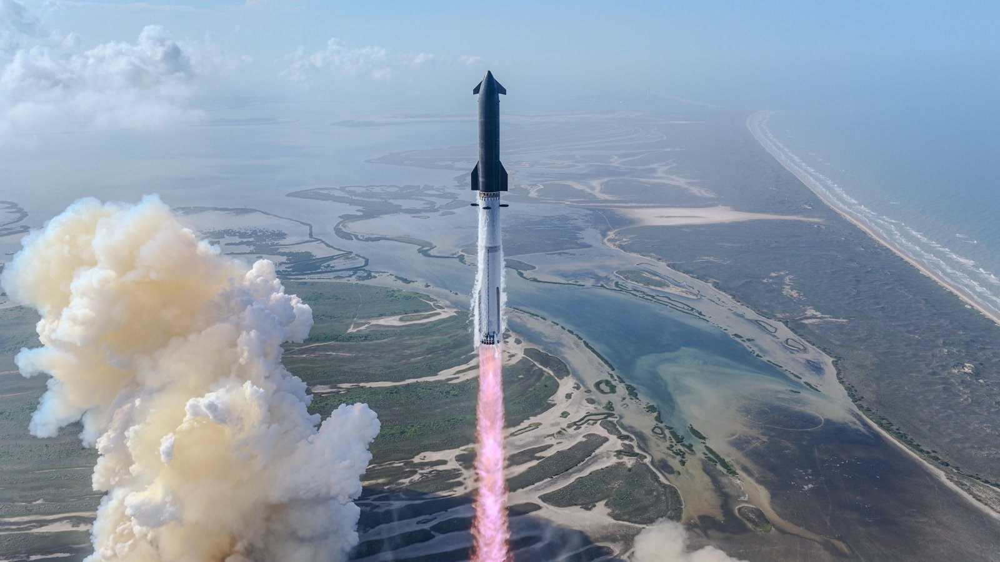

# SpaceX sets IPO price at 135 dollars, valuing company at 1.77 trillion and trading June 12 on Nasdaq as SPCX

**Summary:** SpaceX disclosed this week that its IPO price will be 135 dollars per share, implying a 1.77 trillion dollar valuation. Trading will begin on the Nasdaq under the ticker SPCX on June 12, with the raise expected to eclipse Alibaba 2014 21.8 billion dollar record.

## The Key Numbers

- **IPO price:** 135 dollars per share
- **Valuation:** 1.77 trillion dollars, derived from the offering price and new-share count
- **Trading start:** June 12, 2026
- **Exchange and ticker:** Nasdaq, SPCX
- **Share offering:** 555.6 million shares
- **Expected raise:** 75 billion dollars, which would surpass the 21.8 billion dollar record set by Alibaba in 2014
- **U.S. market-cap rank:** seventh, behind NVIDIA, Apple, Alphabet, Microsoft, Amazon and Broadcom

## What "Largest IPO Ever" Actually Means

According to SpaceX roadshow video, the company is targeting a long-term total addressable market of 28.5 trillion dollars, just below the 30.8 trillion dollar U.S. GDP in 2025. About 23 trillion dollars of that sits in "enterprise AI applications", a target the company believes is reachable through its launch dominance and the Starlink broadband constellation.

SpaceX chief financial officer Bret Johnsen, in the same roadshow video, laid out what he sees as the company's moat:

> "Why do we think we're going to win? I think it starts first and foremost with our global leadership position in orbital launch services. We have an unrivaled satellite and connectivity platform that really leverages vertical integration from design, manufacturing, deployment and operations, and now really truth-seeking AI models enhanced by real-time data from our X platform."

## From Launch Company to Conglomerate

SpaceX is positioning itself in its S-1 filing as a conglomerate with exposure to AI, advertising, communications, and space manufacturing and operations, no longer a pure-play rocket maker. The frame folds in the 2023 acquisition of xAI, the X social platform (formerly Twitter), the Colossus supercomputer in Tennessee, and a planned fleet of one million off-Earth AI data centers to be launched aboard Starship.

The numbers underpinning the frame: in 2025 SpaceX flew 85 percent of all the satellites that reached orbit, most of them its own Starlink broadband craft. Starlink now makes up more than 75 percent of all active satellites in Earth orbit.

## Where Starship Fits In

Starship is the hardware that makes the AI-data-center vision physically possible. The vehicle, designed to be fully and rapidly reusable, is the largest and most powerful rocket ever built. It has flown 12 test flights to date, the most recent on May 22, 2026, all of them suborbital. The million off-Earth AI data centers in SpaceX roadshow will not become real until Starship is operating at airline-like cadence.

## Sources (original pages)

- [SpaceX 1.77 trillion dollar valuation to make it 7th most valuable U.S. company — Space.com](https://www.space.com/space-exploration/usd1-77-trillion-spacex-is-about-to-become-the-7th-most-valuable-american-company)
