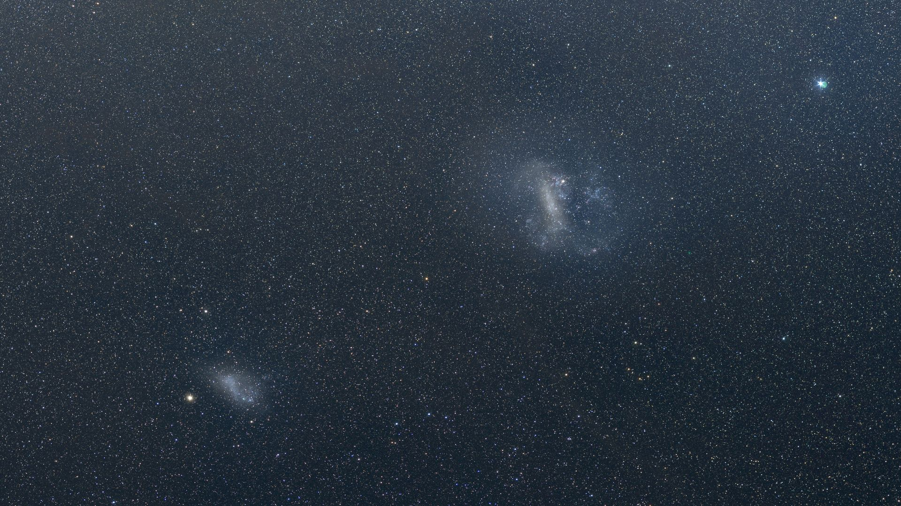

**Summary:** A team led by Sreepriya Vijayasree of the Leibniz Institute for Astrophysics Potsdam (AIP) has used 11 years of stellar motions from the VISTA Survey of the Magellanic Clouds (VMC) to show that the Small Magellanic Cloud's stars are not orbiting in a tidy rotating disk as long assumed. Instead, the stars stream outward along a southeast–northwest axis that, when extended, points straight back to the Large Magellanic Cloud — exactly the pattern expected if LMC tides are pulling SMC apart. VISTA also detected an older ~2-billion-year-old red-giant population drifting coherently northward, a fossil of a still-earlier gravitational encounter. The findings were released by AIP on June 7, 2026.

## What the survey sees

For decades, the SMC has been treated as a textbook example of a rotating dwarf galaxy — a compact, disk-like system in which stars orbit an orderly common center. The new VISTA measurements change that picture. Over 11 years, the 4-meter VISTA telescope at ESO's Paranal site in Chile measured the proper motions (tiny sideways drifts across the sky) of millions of individual stars inside the SMC. VISTA's near-infrared vision penetrates much of the dust that has long obscured the SMC's interior; with the dust out of the way, the stellar kinematics can finally be mapped at population scale.

When the millions of velocity vectors are stacked, the rotation signal that everyone expected is essentially absent. What appears instead is a wholesale flow: stars moving radially outward from the SMC's core, aligned along a southeast–northwest axis. Extend that line, and it points directly to the LMC. This is the smoking-gun signature of tidal stripping — the LMC's gravity, acting repeatedly over billions of years, has bent the SMC's internal motions away from rotation and toward large-scale expansion. "The results reveal large-scale tidal expansion throughout the SMC and challenge long-standing assumptions that the Small Magellanic Cloud behaves like a rotating disk," said Vijayasree, the paper's lead author.

## An older fossil

A second, more subtle signature sits in the SMC's red-giant population. Those ~2-billion-year-old stars drift coherently northward — a direction inconsistent with the younger stars' southeast–northwest outflow. The two patterns together argue that the LMC–SMC system has been gravitationally encountering each other on and off for at least 2 billion years, with each encounter writing its own velocity imprint into the surviving stars. "When I saw the results for the first time, I was amazed by the quality of the measured stellar motions," said Florian Niederhofer of AIP. "By combining observations that have been taken over a time baseline of more than a decade, we can now see the SMC's history written into the way its stars move."

## What happens next

The paper closes with a long-timescale view: the Magellanic Clouds are losing orbital energy to the Milky Way's dark-matter halo, and recent simulations suggest that they will eventually merge with the Milky Way in a few billion years. Until then, the two dwarfs will stay bound to each other — even if the bigger brother keeps picking on the little one.

## Sources (original pages)

- [Trouble near the Milky Way: The Large Magellanic Cloud is ripping its smaller neighbor galaxy apart](https://www.space.com/astronomy/galaxies/trouble-near-the-milky-way-the-large-magellanic-cloud-is-ripping-its-smaller-neighbor-galaxy-apart) (space.com, 2026-06-07)
- Survey instrument: ESO VISTA telescope at Cerro Paranal, Chile; VMC Survey
- Quoted: Sreepriya Vijayasree (lead author), Florian Niederhofer (AIP) — directly quoted in the space.com article
